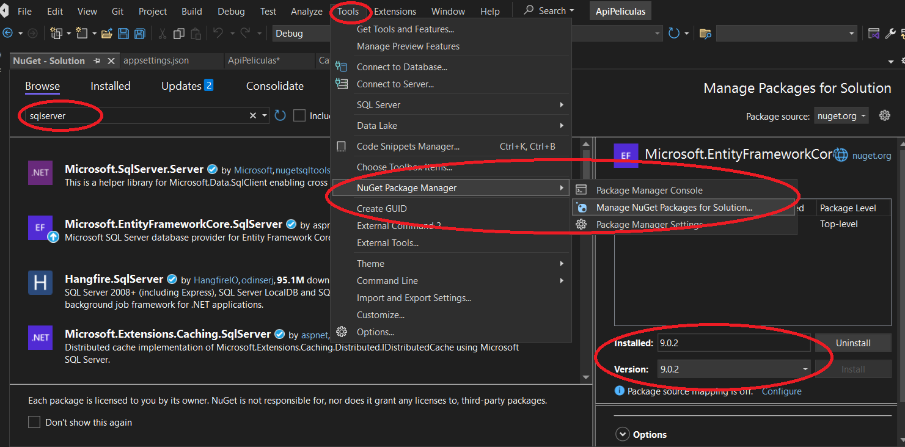
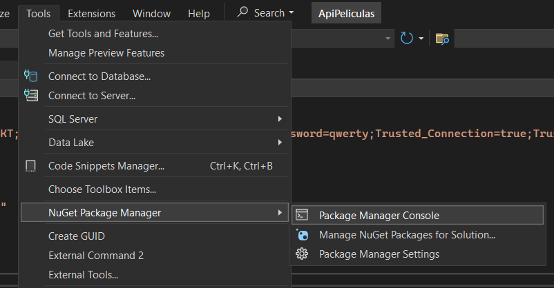

# ASP .Net

**Índice**

* [Instalaremos las dependecias que hagan falta](#id0)
* [Conexion a la Base de datos](#id1)
* [ApplicationDbContext](#id2)
* [Models](#id3)

---

<div id='id0' />

## Instalaremos las dependecias que hagan falta

Links de descargas para el ***dot net 8, Visual Studio, SQL Server y SSMS***

* https://visualstudio.microsoft.com/es/
* https://dotnet.microsoft.com/en-us/download/dotnet/8.0
* https://www.microsoft.com/es-co/sql-server/sql-server-downloads
* https://learn.microsoft.com/es-es/sql/ssms/download-sql-server-management-studio-ssms?view=sql-server-ver16

Instalacion de dependecias para el proyecto.

 

### Dependencias necesarias 
"***Microsoft.SqlServer.Server***"

"***Microsoft.EntityFramework.Tools***"

"***Microsoft.EntityFrameworkCore***"

La descargaremos en el apartado ***Tools***
* ***Tools***
  * NuGet Package manager
    * Manager NuGet Packages for Solution...
* En el buscador introduciremos la dependencia que queremos instalar ***sqlserver***
* Intalaremos para la version que tenermos en el proyecto

---

<div id='id1' />

## Conexion a la Base de datos

***appsettings.json***

* Agregar el string de conexion con la DB

```json
"ConnectionStrings": {
    "ConexionSql": "Server=DESKTOP-BFAMBKT;Database=ApiPeliculasNET8;User ID=sa;Password=qwerty;Trusted_Connection=true;TrustServerCertificate=true;MultipleActiveResultSets=true",
}
```

Server=[server_name];Database=[database_name];User ID=[sa];Password=[qwerty]

String de conexin -> "Server=localhost\SQLEXPRESS;Database=master;Trusted_Connection=True;"

* Conigurar la cadena de conexion en ***Program.cs***

***Program.cs***
```c#
// Add services to the container.
builder.Services.AddDbContext<ApplicationDbContext>(opciones => 
opciones.UseSqlServer(builder.Configuration.GetConnectionString("ConexionSql")));
```
  
---

<div id='id2' />

## ApplicationDbContext

El ***archivo de contexto*** es quien se va a encargar de mappear todas las entidades a la base de datos

**nota:** Siempre se crea dentro de la clase Data

```c#
public class ApplicationDbContext: DbContext
{
    public ApplicationDbContext(DbContextOptions<ApplicationDbContext> options): base(options){}

    // Aqui pasar todas las entidades (Modelos)
    public DbSet<Categoria> Categorias { get; set; }
}
```

Despues de estar todo creado y configurado bien, pues podemos abrir la consola y hacer las migraciones para crear la bd y las tablas correspondientes

eg:


* Aca ejecutamos el siguiente comando: ***add-migration [migration_name]*** para crear las migraciones, se crean a partir de una carpeta llamada ***Migrations***

***nota:*** Los nombre de las migraciones tienen que ser bien descriptivos eg: InitialMigration, CreateProductTable, etc..

>add-migration InitialMigration

* En caso que haya error pues podemos remover las migraciones con este comando
>remove-migration

* Luego cuando todo este correctamente pues ejecutamos ***update-database*** para crear la base de datos y ejecutar las migraciones para crear las tablas correspondientes

>update-database


<div id='id3' />

## Models

Anotaciones

* [Key] -> hace referencia a la anotacion del ID autoincremental
* [Required] -> Nos dice que el campo tiene que ser requerido

```c#
[Key]
public int Id { get; set; }
[Required]
public string Nombre { get; set; }
[Required]
public DateTime FechaCreacion { get; set; }
```