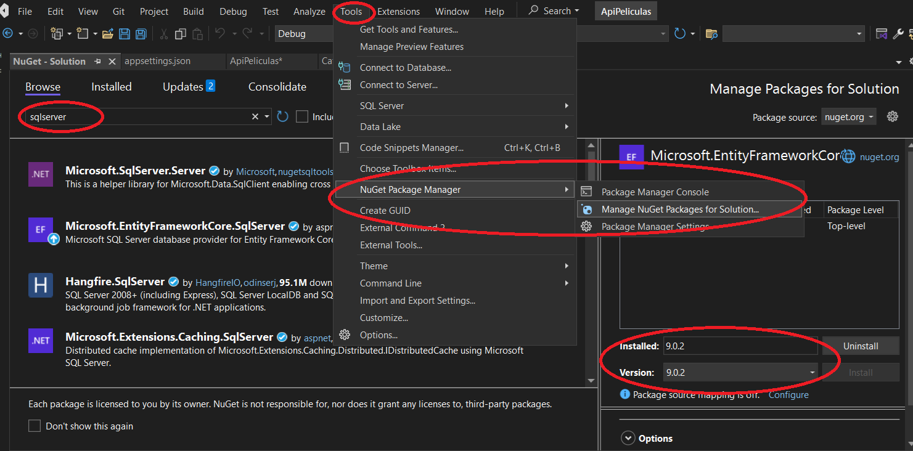

Instalacion de dependecias para el proyecto.

 

### Listado de dependencias a instalar si se necesitan

"***Microsoft.EntityFrameworkCore.SQLServer***"

"***Microsoft.EntityFramework.Tools***"

"***Microsoft.SqlServer.Server***"

"***Microsoft.EntityFrameworkCore***"

"***AutoMapper***"

La descargaremos en el apartado ***Tools***
* ***Tools***
  * NuGet Package manager
    * Manager NuGet Packages for Solution...
* En el buscador introduciremos la dependencia que queremos instalar ***sqlserver***
* Intalaremos para la version que tenermos en el proyecto

---

