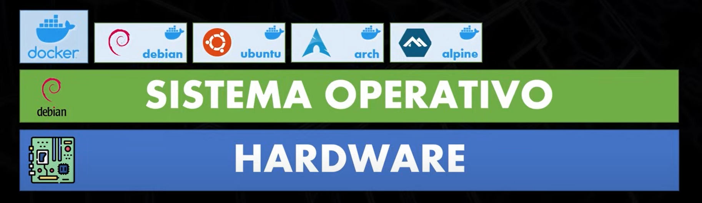
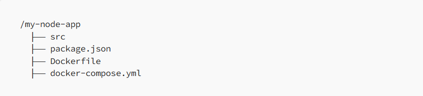

# Docker

## Índice

1. [Introduccion](#id1)
   - [Despliegue en servidores(Fisicos)](#id1.1)
   - [Maquinas virtuales](#id1.2)
   - [Contenedores](#id1.3)
2. [Porque son mas ligeros?](#id2)
3. [Comparación rápida](#id3)
4. [Instalacion](#id4)
5. [Crear contenedores](#id5)
   - [5.1.0 Para crear un contenedor que contenga MySQL en la version 8](#id5.1)
   - [5.1.1 Para crear un contenedor que contenga PostgreSQL en la version 15](#id5.1.1)
   - [5.1.2 Para crear una aplicación Spring Boot en un contenedor de Docker](#id5.1.2)
6. [Comandos](#idCommand)
7. [Angular](#idAngular)

<div id='id1' />

## 1. Introduccion

NOTA: Como se desplegaba antes.

<div id='id1.1' />

### 1.1 Servidores(Fisicos)

Tendriamos que tener un servidor fisico (hardware), le instalamos un sistema operatico (windows, linux), instalamos motor de bases de datos, node y nuestra app.

Si qusieramos tener otra aplicasion que este totalmente aislada de esta y que no comparta el sistema de archivos ni procesos nesecitamos otro servidor fisico con todo lo antes mencionado.

Servidores físicos

- Ejecutan directamente el sistema operativo y las aplicaciones sobre hardware real.
- Cada aplicación comparte el mismo sistema operativo y recursos del servidor.
- No hay aislamiento natural entre aplicaciones, lo que puede generar conflictos y requiere configuraciones personalizadas para evitar problemas.


### 1.2 Maquinas vistuales

Para desplegar en maquinas virtuales directamente en el hardware instalamos algo que se llama **_Hipervisor_**. Los separa dependiendo los recursos asignados. Cada uno de estas porciones separadas solo puede ver y utilizar sus archivos, procesos y los recursos que les fueron asignados. Al estar aislados no conocen nada de las maquinas virtuales que estan en el mismo servidor fisico.

**_Hipervisor:_** Nos permite separar los recursos fisicos del servidor como **_CPU_** y memoria **_RAM_** y asignarlos a diferentes maquinas virtuales.

Máquinas virtuales

- Utilizan un hipervisor (como VMware, Hyper-V o KVM) para virtualizar hardware.
- Cada máquina virtual incluye un sistema operativo completo (guest OS) y las aplicaciones.
- El sistema operativo de cada máquina virtual consume una cantidad significativa de recursos (CPU, memoria, almacenamiento).
  Se crea aislamiento entre máquinas, pero esto conlleva un mayor consumo de recursos.


NOTA: Las maquinas virtules y el hipervisor virtualizan el hardware los contenedores virtualizan a nivel sistema operativo.

### 1.3 Contenedores

Instalamos un sistema operativo, instalamos el motor de **_Docker_**, donde podemos poner varios sistemas operativos.

Contenedores

- En lugar de virtualizar el hardware, virtualizan el sistema operativo.
- Comparten el kernel del sistema operativo host y tienen solo las dependencias necesarias para la aplicación.
- Son livianos porque no requieren un sistema operativo completo por contenedor; utilizan el kernel del host y agregan solo bibliotecas y herramientas específicas.




<div id='id2' />

## 2. Porque son mas ligeros?

Los contenedores son más ligeros que las máquinas virtuales y los servidores físicos debido a cómo gestionan los recursos y el aislamiento

Razones principales por las que los contenedores son más ligeros

- a) Sin hipervisor ni emulación de hardware
  - Las máquinas virtuales requieren un hipervisor para emular hardware, lo que introduce una capa adicional de abstracción que consume recursos.
  - Los contenedores, en cambio, se ejecutan directamente sobre el sistema operativo del host, eliminando la necesidad de emulación.
- b) Uso compartido del kernel

  - Cada máquina virtual incluye su propio kernel y sistema operativo, lo que incrementa el tamaño y el uso de memoria.
  - Los contenedores comparten el kernel del sistema operativo del host, lo que los hace significativamente más pequeños y rápidos.

- c) Tamaño reducido de imágenes
  - Las imágenes de contenedores (como las de Docker) solo incluyen las dependencias necesarias para la aplicación, evitando bibliotecas y servicios innecesarios.
  - Esto los hace mucho más pequeños en comparación con un sistema operativo completo de una máquina virtual.
- d) Inicio más rápido
  - Las máquinas virtuales tardan más en arrancar porque deben inicializar el sistema operativo completo y los servicios asociados.
  - Los contenedores arrancan en segundos o incluso menos, ya que simplemente activan los procesos de la aplicación sobre el kernel existente.
- e) Mayor densidad
  - En un mismo servidor físico, puedes ejecutar muchas más aplicaciones usando contenedores en comparación con máquinas virtuales, ya que los contenedores consumen menos recursos.

<div id='id3' />

## 3. Comparación rápida

<table>
  <tr>
    <th>Característica</th>
    <th>Servidor físico</th>
    <th>Máquina virtual</th>
    <th>Contenedor</th>
  </tr>
  <tr>
    <td><i>Kernel</i></td>
    <td>Único</td>
    <td>Uno por máquina virtual</td>
    <td>Compartido</td>
  </tr>
  <tr>
    <td><i>Peso</i></td>
    <td>Alto</td>
    <td>Medio (OS completo por VM)</td>
    <td>Bajo (solo dependencias)</td>
  </tr>
  <tr>
    <td><i>Inicio</i></td>
    <td>Instantáneo</td>
    <td>Lento (OS debe arrancar)</td>
    <td>Rápido (segundos)</td>
  </tr>
  <tr>
    <td><i>Densidad</i></td>
    <td>Limitada</td>
    <td>Limitada</td>
    <td>Muy alta</td>
  </tr>
  <tr>
    <td><i>Uso de recursos</i></td>
    <td>Directo al hardware</td>
    <td>Alto (OS + hipervisor)</td>
    <td>Bajo</td>
  </tr>
</table>

<div id='id4' />

### 4. Instalacion

- **_Windows_**

  - Instalar Docker desktop.

    https://docs.docker.com/desktop/install/windows-install/

    https://docs.docker.com/desktop/install/windows-install/

  - Actualizar el subsisten de linux (WSL).

Instalar versiones desde la consola

```bash
wsl.exe --update
```

Cambiar de version

```bash
wsl --set-version Ubuntu-20.04 2
```

Ejecutar programas

```bash
wsl npm init
```

Versiones instaladas en el sistema

```bash
wsl -l -v
```

Instalar versiones desde la consola

```bash
wsl.exe --update
```

Cambiar de version

```bash
wsl --set-version Ubuntu-20.04 2
```

Ejecutar programas

```bash
wsl npm init
```

Versiones instaladas en el sistema

```bash
wsl -l -v
```

- **_Linux_**

  > aun no pero lo hare, sera el proximo paso

### Actualizar el subsisten de linux (WSL) en windows.

Actualizar

```bash
wsl.exe --update
```

Version instalada

```bash
wsl.exe --version
```

<div id='id5' />

## 5. Crear contenedores

1. Creamos una archivo (donde se desee) o (casi siempre sera en la raiz del proyecto). Esto es como una receta que dice como crear y configurar los contenedores.

   > docker-compose.yml

<div id='id5.1.0' />

### 5.1 Para crear un contenedor que contenga MySQL en la version 8:

```yml
version: "3.8"
services:
  mysql:
    image: mysql:8 # Le decimos a Docker que use la imagen oficial de MySQL versión 8
    container_name: mysql-container # Nombre del contenedor (puedes elegir otro nombre si prefieres)
    ports:
      - "3306:3306" # Mapea el puerto 3306 de tu contenedor al 3306 de tu máquina local
    environment:
      MYSQL_ROOT_PASSWORD: rootpassword # La contraseña para el usuario root de MySQL
      MYSQL_DATABASE: car-rental # El nombre de la base de datos que vamos a crear
      MYSQL_USER: user # El usuario que se creará para conectarse a la base de datos
      MYSQL_PASSWORD: password # Contraseña para el usuario 'user'
    volumes:
      - mysql_data:/var/lib/mysql # Esto asegura que los datos persistan entre reinicios del contenedor

volumes:
  mysql_data: # Define el volumen donde se guardarán los datos de la base de datos
```

<div id='id5.1.1' />

### 5.1.1 Para crear un contenedor que contenga PostgreSQL en la version 15:

```yml
version: "3.8"
services:
  postgres:
    image: postgres:15 # Usamos la imagen oficial de PostgreSQL versión 15
    container_name: postgres-container # Nombre del contenedor
    ports:
      - "5432:5432" # Mapea el puerto 5432 de tu contenedor al 5432 de tu máquina local
    environment:
      POSTGRES_USER: user # Nombre del usuario de la base de datos
      POSTGRES_PASSWORD: password # Contraseña para el usuario
      POSTGRES_DB: car-rental # El nombre de la base de datos
    volumes:
      - postgres_data:/var/lib/postgresql/data # Persistencia de los datos

volumes:
  postgres_data: # Define el volumen donde se guardarán los datos de PostgreSQL
```

<div id='id5.1.2' />

### 5.1.2 Para crear una aplicación Spring Boot en un contenedor de Docker

### Pasos

- Crear el archivo **_Dockerfile_**
  - 1. Que tegnologias uso para armar la receta de la imagen?
  - 2. Armamos el **_DockerFile_**
  - 3. Ejecutamos el comando para construir la imagen
  - 4. Creamos el contenedor

2. Armamos el **_Dokerfile_**

```Dockerfile
FROM eclipse-temurin:17
LABEL autor=frc90
COPY target/car-rental-0.0.1-SNAPSHOT.jar app.jar
ENTRYPOINT ["java", "-jar", "app.jar"]
```

3. Ejecutamos el comando

```bash
docker build -t car-rental-image:1.1 .
```

4. Creamos el contenedor

```bash
docker run -p8085:8085 --name app-car-rental-container car-rental-image:1.1
```

```Dockerfile
FROM openjdk:17-jdk-slim
VOLUME /tmp
COPY target/my-app.jar my-app.jar
ENTRYPOINT ["java", "-jar", "/my-app.jar"]
```

1. Construye la aplicación: Primero, construye tu aplicación Spring Boot con:

```bash
./mvnw clean package   # Si usas Maven
```

2. Construye la imagen de Docker:

```bash
docker build -t spring-boot-app .
```

3. Ejecuta el contenedor de Spring Boot:

```bash
docker run -p 8080:8080 --name spring-boot-container spring-boot-app
```

<div id='idCommand' />

## Comandos

Se ejecuta el siguiente comando en la consola, raiz donde se encuentra el archivo **_docker-composer.yml_**

```bash
docker-compose up -d
```

El comando **docker-compose up** lo que hacer es: corre la receta y a partir de ella si no hay imagen se crea una. El parametro **-d** hace que el contenedor se ejecute en segundo plano.

```bash
docker ps
```

Saber las imagenes que estan corriendo. Devolveria esto:

```bash
CONTAINER ID   IMAGE     COMMAND                  CREATED          STATUS          PORTS                               NAMES
31334b9750f7   mysql:8   "docker-entrypoint.s…"   11 minutes ago   Up 11 minutes   0.0.0.0:3306->3306/tcp, 33060/tcp   mysql-container
```

Para verificar que se creo y esta corriendo correctamente.

```bash
docker ps -a
```

Saber las imagenes que estan pero no corriendo.

```bash
docker images
```

Ver las imagenes que tenemos

```bash
docker pull postgres:latest
```

```bash
docker pull mysql:8.0
```

Descargar imagenes

- docker pull [name]:[version]
- url: https://hub.docker.com

```bash
docker rm [container_name]
```

Eliminar el contenedor

```bash
docker run -p 8080:8080 [image-name]
```

Correr imagen

```bash
docker run -it ubuntu bash
```

Correr otro sistema en docker

<div id="idAngular"/>

## 7. Angular

### Estructura del proyecto




**_DOCKERFILE_**

```docker
# Use the official Node.js image for building Angular
FROM node:16

# Set the working directory inside the container
WORKDIR /app

# Copy package.json and package-lock.json for dependency installation
COPY package*.json ./

# Install Angular dependencies
RUN npm install

# Copy the application code into the container
COPY . .

# Build the Angular app
RUN npm run build --prod

# Use Nginx to serve the built Angular app
FROM nginx:alpine
COPY --from=0 /app/dist /usr/share/nginx/html

# Expose port for Angular app
EXPOSE 80

# Start the Nginx server
CMD ["nginx", "-g", "daemon off;"]
```

Para crear la imagen

```cmd
docker run -p 80:80 sampleapp
```

Para produccion

**_docker-compose.yml_**

```docker
version: '3.8'
services:
  app:
    build:
      context: .
      dockerfile: Dockerfile
    ports:
      - "80:80"
    environment:
      - NODE_ENV=production
    volumes:
      - .:/usr/src/app
    restart: always
```
