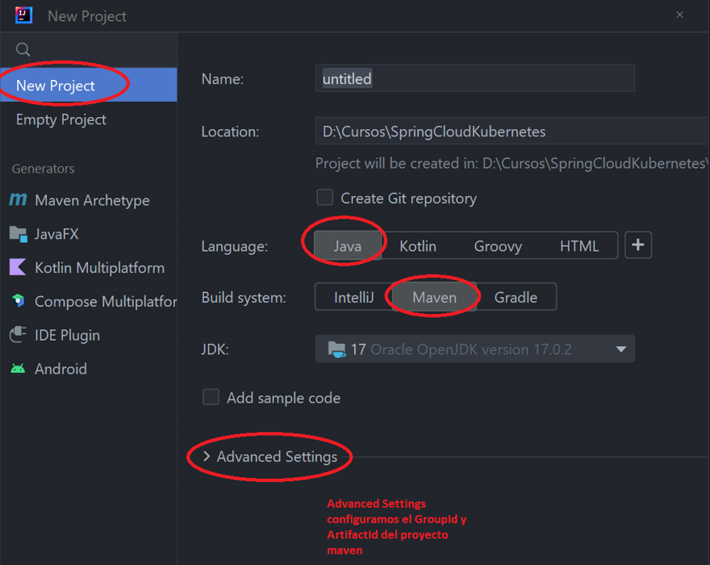
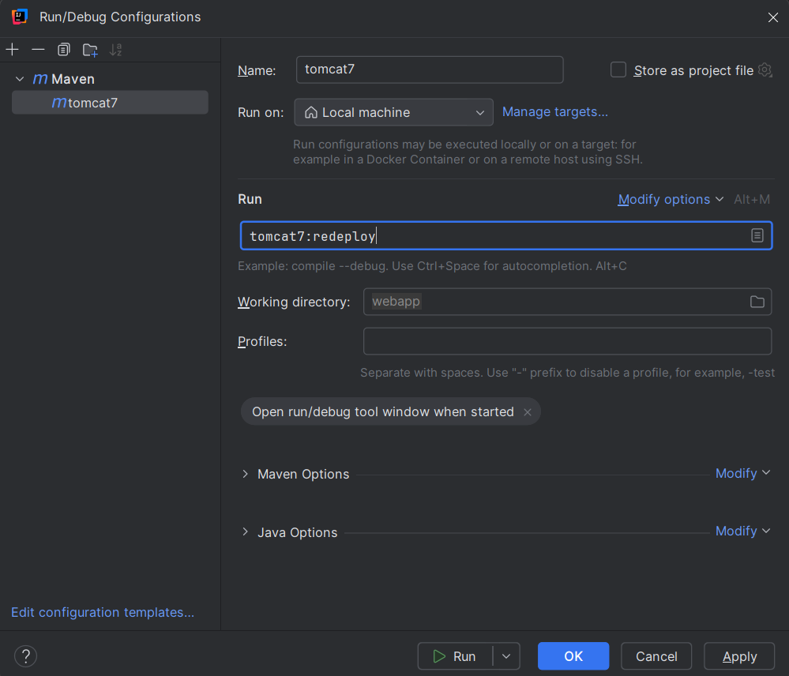

## **Index**

1. [Instalacion de Apache Tomcat](#id1)
2. [Creando y configurando un proyecto Java EE en IntelliJ](#id2)
3. [Levantar y correr la app desplegada en el server Tomcat](#id3)

<div id="id1"/>

## 1. Instalacion de Apache Tomcat

- Descargar el **_Apache Tomcat 10_**

  > https://tomcat.apache.org/whichversion.html

- Descomprimir en cualquier lugar y copiar la ruta [***mi ruta***]

  > C:\workspace\JEE\apache-tomcat-10.1.39

- Configurar el usuario **_admin_**, navegamos hacia la ruta
  > C:\workspace\JEE\apache-tomcat-10.1.39\conf

Abrimos el archivo **_tomcat-users.xml_** y agragamos este codigo para poder tener acceso al servidor tomcat

```xml
<?xml version="1.0" encoding="UTF-8"?>
<tomcat-users xmlns="http://tomcat.apache.org/xml"
              xmlns:xsi="http://www.w3.org/2001/XMLSchema-instance"
              xsi:schemaLocation="http://tomcat.apache.org/xml tomcat-users.xsd"
              version="1.0">

  <!-- Linea a agregar -->
  <user username="admin" password="12345" roles="admin, manager-gui, manager-script"/>

</tomcat-users>
```

<div id="id2"/>

## 2. Creando y configurando un proyecto Java EE en IntelliJ

- Creamos el proyecto



- Configuramos el **_pom.xml_** con **_Alt+Insert_**

```xml
<?xml version="1.0" encoding="UTF-8"?>
<project xmlns="http://maven.apache.org/POM/4.0.0"
         xmlns:xsi="http://www.w3.org/2001/XMLSchema-instance"
         xsi:schemaLocation="http://maven.apache.org/POM/4.0.0 http://maven.apache.org/xsd/maven-4.0.0.xsd">
    <modelVersion>4.0.0</modelVersion>

    <!-- Configuraciones por defecto del proyecto -->

    ...

    <!-- Configuraciones necesarias  -->

    <!-- El empaquetado Web Archive Rar [war] -->
    <packaging>war</packaging>

    <!-- Dependencias necesarias -->
    <dependencies>
        <dependency>
            <groupId>jakarta.platform</groupId>
            <artifactId>jakarta.jakartaee-api</artifactId>
            <version>9.1.0</version>
            <scope>provided</scope>
        </dependency>
    </dependencies>
    <build>
        <plugins>
            <plugin>
                <groupId>org.apache.maven.plugins</groupId>
                <artifactId>maven-compiler-plugin</artifactId>
                <version>3.13.0</version>
            </plugin>
            <plugin>
                <groupId>org.apache.tomcat.maven</groupId>
                <artifactId>tomcat7-maven-plugin</artifactId>
                <version>2.2</version>
                <configuration>
                    <url>http://localhost:8080/manager/text</url>
                    <username>admin</username>
                    <password>12345</password>
                </configuration>
            </plugin>
<!--            <plugin>-->
<!--                <artifactId>maven-war-plugin</artifactId>-->
<!--                <version>3.4.0</version>-->
<!--            </plugin>-->
        </plugins>
    </build>

</project>
```

Luego sincronizamos con maven para que descargue los paquetes.

- Creamos una carpeta llamada **_webapp_**

  > nota: **_webapp_** es un nombre por convencion

- Dentro creamos un archivo **index.html**


- Creamos una configuracion para iniciar la webapp


- Agregamos una configuracion de **_maven_**


- Configuramos lo necesario y aplicamos



Luego ejecutamos en run.

<div id="id3"/>

## 3. Levantar y correr la app desplegada en el server Tomcat

- Abrimos una **_consola_** en la direccion donde se encuentra el server **_Tomcat_**

> C:\workspace\JEE\apache-tomcat-10.1.39\bin

- Escribimos lo siguiente para levantarlo o lo ejecutamos manualmente

```cmd
startup.bat
```

- En el navegador vamos a la direccion de la **_webapp_**

> http://localhost:8080/webapp

- Entramos a la ruta de administracion para los despliegues

> http://localhost:8080/manager

username: admin

password: 12345

> nota: aca podemos gestionar nuestras webapp y hacer despliegues manuales
