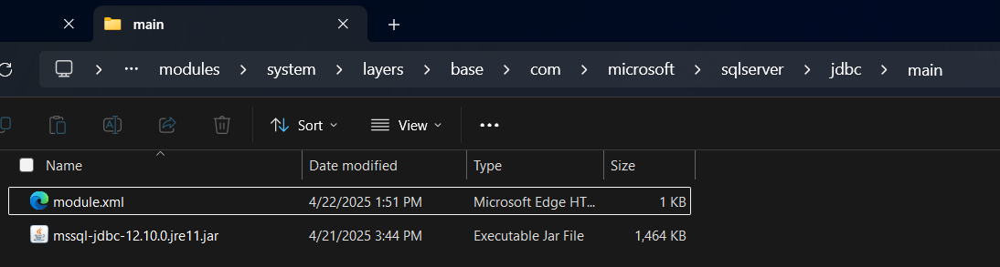
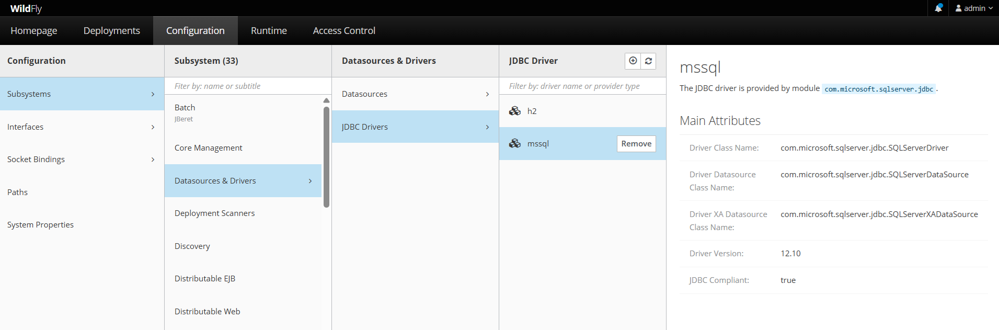

## 🛠️ Paso 1: Instalar WildFly en Windows

### 📥 1. Descargar WildFly
- Andá a la web oficial:  
  👉 [https://www.wildfly.org/downloads/](https://www.wildfly.org/downloads/)
- Bajá la versión más reciente (por ejemplo `WildFly 30.0.1 Final`).

### 📂 2. Extraer el ZIP
- Extraelo en una carpeta fácil, por ejemplo:  
  `C:\wildfly`

### ⚙️ 3. Probar que funciona
Abrí PowerShell y ejecutá:
```powershell
cd C:\wildfly\bin
.\standalone.bat
```

> Esto levanta el servidor. Si ves logs con `WildFly Full <versión> started`, entonces ¡funciona!


Para agregar usuarios para acceder al panel admin, navegamos a la carpeta `..\wildfly-36.0.0.Final\bin`
* ejecutaremos el archivo `add-user
.bat` y se abrira un `cmd`

* agregaremos un usuario de gestion seleccionando (a)
`a) Management User`

* crearemos un usuario llamado `admin` y seleccionaremos `a) Update the existing user password and roles`

user: admin
password: qwerty

---

¡Buenísimo! 🎉 Entonces ya tenemos:

- ✅ Dependencia del driver SQL Server funcionando  
- ✅ WildFly 36 con Jakarta EE 10 y Java 17  
- ✅ Proyecto estructurado  
- ✅ DAO y Service listos  
- ✅ `persistence.xml` correcto y funcional  

---

### 🔽 Siguiente paso: Configurar el *DataSource* en WildFly

Como estás usando una conexión JTA (`<jta-data-source>java:/sqlserverDS</jta-data-source>`), necesitás registrar ese datasource (`sqlserverDS`) en WildFly.

---

### 🛠 Paso a paso para configurar el *datasource* en WildFly

#### ✅ Opción 1: Usando la consola administrativa

1. Iniciá WildFly y entrá a la consola admin:
   - Navegá a [http://localhost:9990](http://localhost:9990)

2. Andá a **"Configuration" → "Subsystems" → "Datasources" → "Non-XA" → Add**

3. Completá:
   - **JNDI Name**: `java:/sqlserverDS`
   - **Connection URL**:  
     ```
     jdbc:sqlserver://localhost:1433;databaseName=gestion_pedidos
     ```
   - **Driver**: `mssql` (lo agregás abajo)
   - **User/Password**: los de tu SQL Server

4. Si no existe el *driver*, WildFly te pedirá cargar uno:
   - Cargá el `.jar` del driver (el mismo `mssql-jdbc-12.10.0.jre11.jar`)
   - Tipo: **module**
   - Nombre: `com.microsoft.sqlserver`

5. Testeá la conexión y guardá.

---

#### ✅ Opción 2: Manualmente, por archivos

1. Crear un *module* para el driver SQL Server en:

```
WILDFLY_HOME/modules/com/microsoft/sqlserver/jdbc/main/
```

2. Dentro, poné:
- `mssql-jdbc-12.10.0.jre11.jar`
- un `module.xml` como este:



***module.xml***

```xml
<?xml version="1.0" encoding="UTF-8"?>
<module xmlns="urn:jboss:module:1.5" name="com.microsoft.sqlserver.jdbc">
    <resources>
        <resource-root path="mssql-jdbc-12.10.0.jre11.jar"/>
    </resources>
    <dependencies>
        <module name="javax.api"/>
        <!-- <module name="jakarta.api"/> -->
        <module name="javax.transaction.api"/>
    </dependencies>
</module>
```

- despues de crear el `module.xml` se accede wildfly `http://localhost:9990/` se inicia como admin y se agrega el driver




1. Luego en `standalone.xml`, agregás tu datasource:

```xml
<datasource jndi-name="java:/sqlserverDS" pool-name="SQLServerDS" enabled="true" use-java-context="true">
    <connection-url>jdbc:sqlserver://localhost:1433;databaseName=gestion_pedidos</connection-url>
    <driver>mssql</driver>
    <security>
        <user-name>sa</user-name>
        <password>qwerty</password>
    </security>
</datasource>

<drivers>
    <driver name="mssql" module="com.microsoft.sjdbc">
      <driver-class>com.microsoft.sqlserSQLServerDriver</driver-class>
      <xa-datasource-class>com.microsoft.sqlserSQLServerXADataSource</xa-datasource-class>
      <datasource-class>com.microsoft.sqlserSQLServerDataSource</datasource-class>
    </driver>
</drivers>
```

---


¡Perfecto que estés en esto! El archivo `standalone.xml` **ya existe** si estás usando WildFly en modo standalone, y **no se crea manualmente**, viene con la instalación.

---

### 📍¿Dónde está `standalone.xml`?

Está en la siguiente ruta dentro de tu instalación de WildFly:

```
WILDFLY_HOME/standalone/configuration/standalone.xml
```

Ejemplo si lo tenés en `C:\wildfly-36.0.0.Final`:

```
C:\wildfly-36.0.0.Final\standalone\configuration\standalone.xml
```

---

### 📝 ¿Qué hacer ahora?

1. **Abrí `standalone.xml`** con un editor como IntelliJ, VS Code o Notepad++.
2. Buscá la sección:

```xml
<datasources>
    ...
</datasources>
```

Ahí es donde vas a agregar tu datasource personalizado (`sqlserverDS`).

3. También dentro de `<datasources>`, abajo de `<drivers>`, agregás tu driver `mssql`.

---

### 📌 ¿No encontrás `standalone.xml`?

Puede ser que estés usando **modo domain** por accidente (raro, pero puede pasar). Asegurate de estar ejecutando el servidor con:

```bash
standalone.bat
```
o en Linux/macOS:
```bash
./standalone.sh
```

No usés `domain.sh` ni `domain.bat`, eso es otro modo.

---

Si ya configuraste el `standalone.xml`, podés comprobar que tu **datasource SQL Server** está correctamente registrado en WildFly con alguno de estos métodos:

---

### ✅ Opción 1: Usar la consola web de administración

1. Abrí tu navegador y andá a:

```
http://localhost:9990
```

2. Iniciá sesión (usuario/contraseña que creaste con `add-user.bat`).
3. Navegá a:

   ```
   Configuration → Subsystems → Datasources → Non-XA → tu datasource (ej: sqlserverDS)
   ```

4. Hacé clic en el nombre de tu datasource.
5. Presioná **"Test Connection"** (hay un botón).
   - Si dice **"Successfully tested connection"**, ¡está todo ok!
   - Si falla, el mensaje te dirá si es problema del driver, URL, usuario, etc.

---

### ✅ Opción 2: Usar la línea de comandos (CLI)

1. Abrí el **WildFly CLI**:
   ```bash
   jboss-cli.bat --connect
   ```

2. Ejecutá este comando para ver si tu datasource está registrado:
   ```bash
   /subsystem=datasources/data-source=sqlserverDS:read-resource
   ```

   Si está todo bien, verás un bloque con los detalles del datasource.

---

### ✅ Opción 3: Ver en el log de arranque

Cuando arranca WildFly (`standalone.bat`), en la consola debería aparecer algo como:

```
WFLYJCA0005: Deploying non-JDBC-compliant driver class com.microsoft.sqlserver.jdbc.SQLServerDriver (version ...)
WFLYJCA0018: Bound data source [java:/sqlserverDS]
```

Si ves eso, entonces está cargado el driver y el datasource correctamente.

---

¿Querés que hagamos una prueba conectando desde JPA ahora para ver si persiste una entidad o lanzamos una consulta simple?