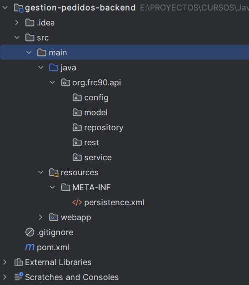
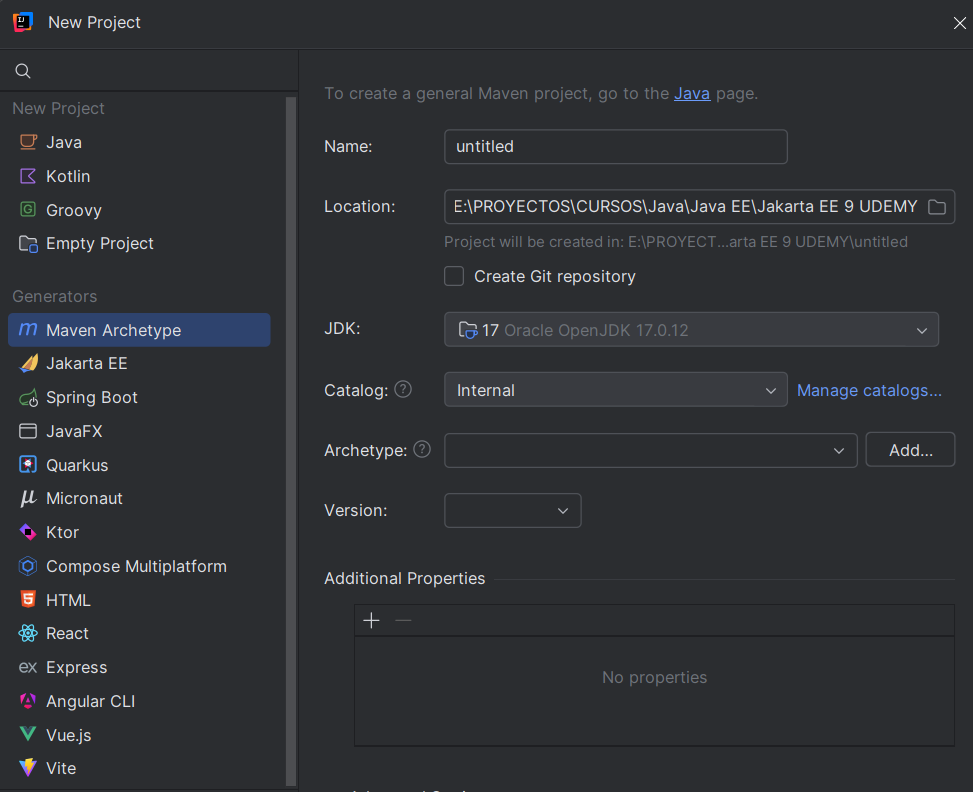

Construir el **backend con Java EE (JAX-RS + JPA)**.

## 🧱 Paso 2: Crear el proyecto Maven para el backend

Vamos a crear un proyecto Maven con:
- API REST usando **JAX-RS**
- Persistencia con **JPA**
- Conector para la base de datos (por ahora usamos H2 o PostgreSQL)
- Deployment en **WildFly**

---

### ✅ Estructura básica del backend

```plaintext
gestion-pedidos-backend/
├── pom.xml
├── src/
│   └── main/
│       ├── java/
│       │   └── com/tuempresa/pedidos/
│       │       ├── model/         <- Entidades JPA
│       │       ├── rest/          <- Servicios REST
│       │       └── service/       <- Lógica de negocio
│       └── resources/
│           ├── META-INF/persistence.xml  <- Configuración JPA
│           └── WEB-INF/web.xml          <- Configuración JAX-RS (si es necesario)
```


¡Excelente iniciativa! Tener una estructura de proyecto limpia y ordenada es clave para trabajar cómodo y entender bien cómo encajan todas las piezas.

### 🧱 Estructura recomendada para tu proyecto `gestion-pedidos-backend`

Aquí te propongo una estructura clásica para una app Jakarta EE con JPA, JAX-RS, y MVC (si llegamos a usarlo). Esta convención te va a ayudar incluso si luego desplegás en WildFly o pasás a proyectos más grandes.

```
src
└── main
    ├── java
    │   └── org
    │       └── frc90
    │           └── api
    │               ├── config          # Configuraciones generales (JAX-RS, filtros, etc.)
    │               ├── model           # Entidades JPA (Pedido, Cliente, etc.)
    │               ├── repository      # Clases DAO o repositorios para acceso a datos
    │               ├── service         # Lógica de negocio (ej: procesar pedido)
    │               └── rest            # Clases con @Path - puntos REST
    ├── resources
    │   └── META-INF
    │       └── persistence.xml         # Configuración de JPA
    └── webapp
        ├── WEB-INF
        │   └── web.xml                 # Opcional, según configuración
        └── index.jsp                   # Archivo de prueba si querés usar JSP
```

---

#### Paso 1: Crea los paquetes en `src/main/java`
En IntelliJ:
- Crea la carpeta `java` en `src/main` 
- Haz clic derecho en `src/main/java`
- Selecciona `New > Package`
- Crea:  
  - `org.frc90.api.config`
  - `org.frc90.api.model`
  - `org.frc90.api.repository`
  - `org.frc90.api.service`
  - `org.frc90.api.rest`




---

## 🛠️ Crear proyecto Maven desde IntelliJ IDEA

### 📌 En la imagen que se muestra:



<br>

1. **Name**: `gestion-pedidos-backend`
2. **Location**: Dejá donde quieras (o como está).
3. **JDK**: ✅ Ya tenés seleccionado `17 Oracle OpenJDK 17.0.12`, perfecto.
4. **Catalog**: Dejá `Internal`.
5. **Archetype**:  
   - Hacé clic en `Add...`
   - En el cuadro que aparece, usá:
     - **GroupId**: `org.apache.maven.archetypes`
     - **ArtifactId**: `maven-archetype-webapp`
     - **Version**: podés usar la que te sugiera IntelliJ (por ejemplo, `1.4` o `1.0`)

6. Hacé clic en **Crear**.

---

## 🧪 Siguiente paso

---

## 🧱 Paso 3: Configurar el `pom.xml` del proyecto `gestion-pedidos-backend`

Dentro del proyecto recién creado (con `maven-archetype-webapp`), abrí el archivo `pom.xml` y reemplazá su contenido por esto:

```xml
<project xmlns="http://maven.apache.org/POM/4.0.0" xmlns:xsi="http://www.w3.org/2001/XMLSchema-instance"
  xsi:schemaLocation="http://maven.apache.org/POM/4.0.0 http://maven.apache.org/maven-v4_0_0.xsd">
  <modelVersion>4.0.0</modelVersion>
  <groupId>org.frc90.api</groupId>
  <artifactId>gestion-pedidos-backend</artifactId>
  <packaging>war</packaging>
  <version>1.0-SNAPSHOT</version>
  <name>gestion-pedidos-backend</name>
  <url>http://maven.apache.org</url>

  <properties>
    <maven.compiler.source>17</maven.compiler.source>
    <maven.compiler.target>17</maven.compiler.target>
    <failOnMissingWebXml>false</failOnMissingWebXml>
    <project.build.sourceEncoding>UTF-8</project.build.sourceEncoding>
  </properties>

  <dependencies>
    <!-- API Jakarta EE completa (incluye JAX-RS, JPA, CDI, etc.) -->
    <dependency>
      <groupId>jakarta.platform</groupId>
      <artifactId>jakarta.jakartaee-api</artifactId>
      <version>9.1.0</version>
      <scope>provided</scope>
    </dependency>
    <!-- SQL Server -->
    <!-- <dependency>
      <groupId>com.microsoft.sqlserver</groupId>
      <artifactId>mssql-jdbc</artifactId>
      <version>12.4.2.jre11</version>
    </dependency> -->

    <!-- mysql -->
    <dependency>
        <groupId>mysql</groupId>
        <artifactId>mysql-connector-java</artifactId>
        <version>8.0.30</version>
    </dependency>

    <dependency>
      <groupId>junit</groupId>
      <artifactId>junit</artifactId>
      <version>3.8.1</version>
      <scope>test</scope>
    </dependency>
  </dependencies>
  <build>
    <finalName>gestion-pedidos-backend</finalName>
  </build>
</project>
```

---

### 📌 Notas clave:
- `packaging` es `war`: lo necesitamos así para desplegarlo en WildFly.
- `jakarta.jakartaee-api`: ya incluye todo lo necesario para JAX-RS, JPA, CDI.
- `scope` es `provided`: porque WildFly ya trae Jakarta EE.
- Usamos SQL Server

---


## ✅ Próximo paso: Configurar JPA para usar SQL Server

### 📦 1. Agregar dependencia del driver JDBC de SQL Server

Dentro de la sección `<dependencies>` de tu `pom.xml`, agregá esta nueva dependencia:

```xml
<dependency>
  <groupId>com.microsoft.sqlserver</groupId>
  <artifactId>mssql-jdbc</artifactId>
  <version>12.4.2.jre11</version>
</dependency>
```

> 📝 Usamos `jre11` porque es compatible con Java 17.

---

### 🗂 2. Crear archivo `persistence.xml`

Ubicá esta ruta en tu proyecto:

```
src/main/resources/META-INF/persistence.xml
```

***Configuracion para Mysql:***

```xml
<?xml version="1.0" encoding="UTF-8"?>
<persistence xmlns="https://jakarta.ee/xml/ns/persistence"
             xmlns:xsi="http://www.w3.org/2001/XMLSchema-instance"
             xsi:schemaLocation="https://jakarta.ee/xml/ns/persistence https://jakarta.ee/xml/ns/persistence/persistence_3_0.xsd"
             version="3.0">

    <persistence-unit name="gestionPedidosPU" transaction-type="JTA">
        <jta-data-source>java:/GestionPedidosMySQL</jta-data-source>

        <properties>
            <property name="jakarta.persistence.schema-generation.database.action" value="drop-and-create"/>
            <property name="hibernate.dialect" value="org.hibernate.dialect.MySQL8Dialect"/>
            <property name="hibernate.show_sql" value="true"/>
            <property name="hibernate.format_sql" value="true"/>
        </properties>
    </persistence-unit>

</persistence>
```

***Configuración para usar SQL Server:***

```xml
<?xml version="1.0" encoding="UTF-8"?>
<persistence xmlns="https://jakarta.ee/xml/ns/persistence" version="3.0">
    <persistence-unit name="PedidosPU" transaction-type="JTA">
        <jta-data-source>java:jboss/datasources/PedidosDS</jta-data-source>
        <properties>
            <!-- Esto lo maneja el servidor, no hace falta username/password aquí -->
            <property name="jakarta.persistence.schema-generation.database.action" value="drop-and-create"/>
        </properties>
    </persistence-unit>
</persistence>
```

> 🔧 WildFly manejará el pool de conexiones. Configuraremos el *datasource* (`PedidosDS`) en la consola administrativa del servidor para conectar con SQL Server.

---

### ✅ Paso siguiente: Crear la entidad `Pedido`

Vamos a colocarla en el paquete `model`. Esta será nuestra clase JPA (es decir, una entidad que se mapea a una tabla en SQL Server).

#### 📄 Clase `Pedido.java` (`org.frc90.api.model`):

```java
package org.frc90.api.model;

import jakarta.persistence.*;

import java.time.LocalDate;

@Entity
@Table(name = "pedidos")
public class Pedido {

    @Id
    @GeneratedValue(strategy = GenerationType.IDENTITY)
    private Long id;

    private String cliente;

    private String producto;

    private int cantidad;

    @Column(name="fecha_pedido")
    private LocalDate fechaPedido;

    public Pedido() {
    }

    public Pedido(Long id, String cliente, String producto, int cantidad, LocalDate fechaPedido) {
        this.id = id;
        this.cliente = cliente;
        this.producto = producto;
        this.cantidad = cantidad;
        this.fechaPedido = fechaPedido;
    }

    public Long getId() {
        return id;
    }

    public void setId(Long id) {
        this.id = id;
    }

    public String getCliente() {
        return cliente;
    }

    public void setCliente(String cliente) {
        this.cliente = cliente;
    }

    public String getProducto() {
        return producto;
    }

    public void setProducto(String producto) {
        this.producto = producto;
    }

    public int getCantidad() {
        return cantidad;
    }

    public void setCantidad(int cantidad) {
        this.cantidad = cantidad;
    }

    public LocalDate getFechaPedido() {
        return fechaPedido;
    }

    public void setFechaPedido(LocalDate fechaPedido) {
        this.fechaPedido = fechaPedido;
    }
}
```

---

### 🔍 Explicación rápida

| Anotación         | ¿Para qué sirve?                          |
| ----------------- | ----------------------------------------- |
| `@Entity`         | Marca la clase como entidad JPA           |
| `@Table`          | Define el nombre de la tabla (`pedidos`)  |
| `@Id`             | Define la clave primaria                  |
| `@GeneratedValue` | Auto incrementa el ID en la base de datos |
| `@Column`         | Personaliza una columna (opcional)        |


---

### ✅ Crear la interface `PedidoRepository`

📁 Ubicación: `org.frc90.api.repository`

```java
package org.frc90.api.repository;

import org.frc90.api.model.Pedido;

import java.util.List;

public interface PedidoRepository {
    void guardar(Pedido pedido);
    Pedido buscarPorId(Long id);
    List<Pedido> listarTodos();
    Pedido actualizar(Pedido pedido);
    void eliminar(Long id);
}
```

### ✅ Crear la clase `PedidoRepository`

📁 Ubicación: `org.frc90.api.repository.impl`

```java
package org.frc90.api.repository.impl;

import jakarta.ejb.Stateless;
import jakarta.persistence.EntityManager;
import jakarta.persistence.PersistenceContext;
import org.frc90.api.model.Pedido;
import org.frc90.api.repository.PedidoRepository;

import java.util.List;

@Stateless
public class PedidoRepositoryImpl implements PedidoRepository {
    @PersistenceContext(unitName = "gestionPedidosPU")
    private EntityManager em;

    @Override
    public void guardar(Pedido pedido) {
        em.persist(pedido);
    }

    @Override
    public Pedido buscarPorId(Long id) {
        return em.find(Pedido.class, id);
    }

    @Override
    public List<Pedido> listarTodos() {
        return em.createQuery("select p from Pedido p", Pedido.class).getResultList();
    }

    @Override
    public Pedido actualizar(Pedido pedido) {
        return em.merge(pedido);
    }

    @Override
    public void eliminar(Long id) {
        Pedido pedido = em.find(Pedido.class, id);
        if (pedido != null) {
            em.remove(pedido);
        }
    }
}
```

---

### 🔍 ¿Qué hace esta clase?

| Método          | Qué hace                      |
| --------------- | ----------------------------- |
| `guardar()`     | Persiste un nuevo pedido      |
| `buscarPorId()` | Busca por ID                  |
| `listarTodos()` | Trae todos los pedidos        |
| `actualizar()`  | Actualiza un pedido existente |
| `eliminar()`    | Elimina por ID                |

> Usamos `@Stateless` porque es un **EJB** sin estado, que nos permite inyectarlo y usarlo fácilmente en otros componentes (como servicios o controladores REST).

---


### ✅ Crear la interface `PedidoService`

📁 Ubicación: `org.frc90.api.service`

```java
package org.frc90.api.service;

import org.frc90.api.model.Pedido;

import java.util.List;

public interface PedidoService {
    void crearPedido(Pedido pedido);

    public Pedido obtenerPedido(Long id);

    public List<Pedido> listarPedidos();

    public void actualizarPedido(Pedido pedido);

    public void eliminarPedido(Long id);
}
```

### ✅ Crear la clase `PedidoServiceImpl`

📁 Ubicación: `org.frc90.api.service.impl`

```java
package org.frc90.api.service.impl;

import jakarta.ejb.Stateless;
import jakarta.inject.Inject;
import org.frc90.api.model.Pedido;
import org.frc90.api.repository.PedidoRepository;
import org.frc90.api.service.PedidoService;

import java.util.List;

@Stateless
public class PedidoServiceImpl implements PedidoService {

    @Inject
    private PedidoRepository pedidoRepository;

    @Override
    public void crearPedido(Pedido pedido) {
        pedidoRepository.guardar(pedido);
    }

    @Override
    public Pedido obtenerPedido(Long id) {
        return pedidoRepository.buscarPorId(id);
    }

    @Override
    public List<Pedido> listarPedidos() {
        return pedidoRepository.listarTodos();
    }

    @Override
    public void actualizarPedido(Pedido pedido) {
        pedidoRepository.actualizar(pedido);
    }

    @Override
    public void eliminarPedido(Long id) {
        pedidoRepository.eliminar(id);
    }
}
```

---

### 🔍 ¿Qué hace esta clase?

| Método               | Qué hace                                |
| -------------------- | --------------------------------------- |
| `crearPedido()`      | Lógica para inicializar un pedido nuevo |
| `obtenerPedido()`    | Llama al repo para traer uno por ID     |
| `listarPedidos()`    | Llama al repo para traer todos          |
| `actualizarPedido()` | Actualiza un pedido existente           |
| `eliminarPedido()`   | Elimina un pedido                       |

> Usamos `@Inject` para inyectar el DAO en vez de `@EJB` porque `@Inject` es parte de **CDI**, más moderno y flexible.

---

¡Genial! Vamos ahora con el **endpoint REST**, que es lo que se expone al frontend (Angular) para crear, listar, actualizar o eliminar pedidos.

---

### ✅ Crear la clase `PedidoResource`

📁 Ubicación: `org.frc90.api.rest`

```java
@Path("/pedidos")
@Consumes(MediaType.APPLICATION_JSON)
@Produces(MediaType.APPLICATION_JSON)
public class PedidoResource {

    @Inject
    private PedidoService pedidoService;

    @POST
    public Response crearPedido(Pedido pedido) {
        pedidoService.crearPedido(pedido);
        return Response.status(Response.Status.CREATED).build();
    }

    @GET
    public Response listarPedidos() {
        List<Pedido> pedidos = pedidoService.listarPedidos();
        return Response.ok(pedidos).build();
    }

    @GET
    @Path("/{id}")
    public Response obtenerPedido(@PathParam("id") Long id) {
        Pedido pedido = pedidoService.obtenerPedido(id);
        if (pedido == null) {
            return Response.status(Response.Status.NOT_FOUND).build();
        }
        return Response.ok(pedido).build();
    }

    @PUT
    @Path("/{id}")
    public Response actualizarPedido(@PathParam("id") Long id, Pedido pedido) {
        pedido.setId(id);
        pedidoService.actualizarPedido(pedido);
        return Response.ok().build();
    }

    @DELETE
    @Path("/{id}")
    public Response eliminarPedido(@PathParam("id") Long id) {
        pedidoService.eliminarPedido(id);
        return Response.noContent().build();
    }
}
```

---

### 🚀 ¿Qué hace esta clase?

| Método REST            | Ruta               | Acción |
| ---------------------- | ------------------ | ------ |
| `POST /pedidos`        | Crear nuevo pedido |
| `GET /pedidos`         | Listar todos       |
| `GET /pedidos/{id}`    | Obtener uno        |
| `PUT /pedidos/{id}`    | Actualizar         |
| `DELETE /pedidos/{id}` | Eliminar           |

---

### 🔧 ¿Qué falta para que funcione el endpoint?

Debemos registrar JAX-RS en la aplicación web, para que el contenedor (WildFly) sepa que tiene recursos REST.

#### Crea una clase `ApplicationConfig` en `org.frc90.api.config`:

```java
package org.frc90.api.config;

import jakarta.ws.rs.ApplicationPath;
import jakarta.ws.rs.core.Application;

@ApplicationPath("/api")
public class ApplicationConfig extends Application {
    // Aquí no necesitas nada más por ahora
}
```

> Esto hace que todas las rutas REST estén bajo `/api`. Por ejemplo:  
> `http://localhost:8080/gestion-pedidos-backend/api/pedidos`

---

### ✅ Paso 1: Agrega el driver de SQL Server a tu `pom.xml`

```xml
<dependency>
  <groupId>com.microsoft.sqlserver</groupId>
  <artifactId>mssql-jdbc</artifactId>
  <version>12.6.1.jre11</version> <!-- compatible con Java 17 -->
</dependency>
```

> ⚠️ **Importante**: aunque tu app se ejecuta en WildFly, el driver también se puede agregar en el servidor, pero durante desarrollo puedes manejarlo vía Maven.

---

### ✅ Paso 2: Configura `persistence.xml`

📁 Ruta: `src/main/resources/META-INF/persistence.xml`

```xml

<!-- mysql -->
<?xml version="1.0" encoding="UTF-8"?>
<persistence xmlns="https://jakarta.ee/xml/ns/persistence"
             xmlns:xsi="http://www.w3.org/2001/XMLSchema-instance"
             xsi:schemaLocation="https://jakarta.ee/xml/ns/persistence https://jakarta.ee/xml/ns/persistence/persistence_3_0.xsd"
             version="3.0">

    <persistence-unit name="GestionPedidosPU" transaction-type="JTA">
        <jta-data-source>java:/GestionPedidosMySQL</jta-data-source>

        <properties>
            <property name="jakarta.persistence.schema-generation.database.action" value="drop-and-create"/>
            <property name="hibernate.dialect" value="org.hibernate.dialect.MySQL8Dialect"/>
            <property name="hibernate.show_sql" value="true"/>
            <property name="hibernate.format_sql" value="true"/>
        </properties>
    </persistence-unit>

</persistence>

<!-- mysql -->
<!--<?xml version="1.0" encoding="UTF-8"?>-->
<!--<persistence xmlns="https://jakarta.ee/xml/ns/persistence"-->
<!--             xmlns:xsi="http://www.w3.org/2001/XMLSchema-instance"-->
<!--             xsi:schemaLocation="https://jakarta.ee/xml/ns/persistence https://jakarta.ee/xml/ns/persistence/persistence_3_0.xsd"-->
<!--             version="3.0">-->

<!--    <persistence-unit name="GestionPedidosPU" transaction-type="JTA">-->
<!--        &lt;!&ndash; Este nombre debe coincidir con tu datasource JNDI configurado en WildFly &ndash;&gt;-->
<!--        <jta-data-source>java:/MySQLDS</jta-data-source>-->

<!--        <properties>-->
<!--            &lt;!&ndash; Para entornos de desarrollo &ndash;&gt;-->
<!--            <property name="jakarta.persistence.schema-generation.database.action" value="drop-and-create"/>-->

<!--            &lt;!&ndash; Dialecto de Hibernate para MySQL 8 &ndash;&gt;-->
<!--            <property name="hibernate.dialect" value="org.hibernate.dialect.MySQL8Dialect"/>-->

<!--            &lt;!&ndash; Opcional: para mostrar las queries SQL en consola &ndash;&gt;-->
<!--            <property name="hibernate.show_sql" value="true"/>-->
<!--            <property name="hibernate.format_sql" value="true"/>-->
<!--        </properties>-->
<!--    </persistence-unit>-->

<!--</persistence>-->

<!-- mssql -->
<!--<?xml version="1.0" encoding="UTF-8"?>-->
<!--<persistence xmlns="https://jakarta.ee/xml/ns/persistence"-->
<!--             xmlns:xsi="http://www.w3.org/2001/XMLSchema-instance"-->
<!--             xsi:schemaLocation="https://jakarta.ee/xml/ns/persistence https://jakarta.ee/xml/ns/persistence/persistence_3_0.xsd"-->
<!--             version="3.0">-->

<!--<persistence-unit name="GestionPedidosPU" transaction-type="JTA">-->
<!--    <jta-data-source>java:/sqlserverDS</jta-data-source>-->

<!--    <properties>-->
<!--        &lt;!&ndash; Opcionales para desarrollo &ndash;&gt;-->
<!--        <property name="jakarta.persistence.schema-generation.database.action" value="drop-and-create"/>-->
<!--        <property name="jakarta.persistence.jdbc.driver" value="com.microsoft.sqlserver.jdbc.SQLServerDriver"/>-->
<!--        <property name="jakarta.persistence.jdbc.url" value="jdbc:sqlserver://localhost:1433;databaseName=gestion_pedidos"/>-->
<!--        <property name="jakarta.persistence.jdbc.user" value="sa"/>-->
<!--        <property name="jakarta.persistence.jdbc.password" value="qwerty"/>-->
<!--    </properties>-->
<!--</persistence-unit>-->
<!--</persistence>-->

<!--
        server_name=DESKTOP-BFAMBKT
        user=sa
        password=qwerty
        Trusted_Connection=true
        TrustServerCertificate=true
        MultipleActiveResultSets=true


-->
```

> 🔐 Cambia `tu_usuario` y `tu_contraseña` por los datos reales de tu SQL Server.


> Estoy usando Jakarta EE 9.1, pero el proveedor JPA Hibernate requiere javax.persistence.* para funcionar correctamente, por eso lo ajusté así.

---


# Solo si se esta usando SQL Server


### ✅ Paso 3: Crea la base de datos en SQL Server

Puedes usar **SQL Server Management Studio (SSMS)** o cualquier cliente para ejecutar:

```sql
CREATE DATABASE gestion_pedidos;
GO
```

---

### 📝 ¿Qué sigue?

Tienes dos opciones:

1. **Configurar el datasource en WildFly** (`java:/sqlserverDS`) desde la consola admin (`http://localhost:9990`) o CLI.
2. O **cambiar `<jta-data-source>` por configuración directa con las propiedades JDBC** (sin usar JNDI, útil durante desarrollo).

Si aún no configuraste el datasource en WildFly, podemos usar el segundo camino por ahora para que funcione directo.

¿Quieres que lo dejemos sin `jta-data-source` y use conexión directa desde `persistence.xml` para que lo puedas probar más rápido?