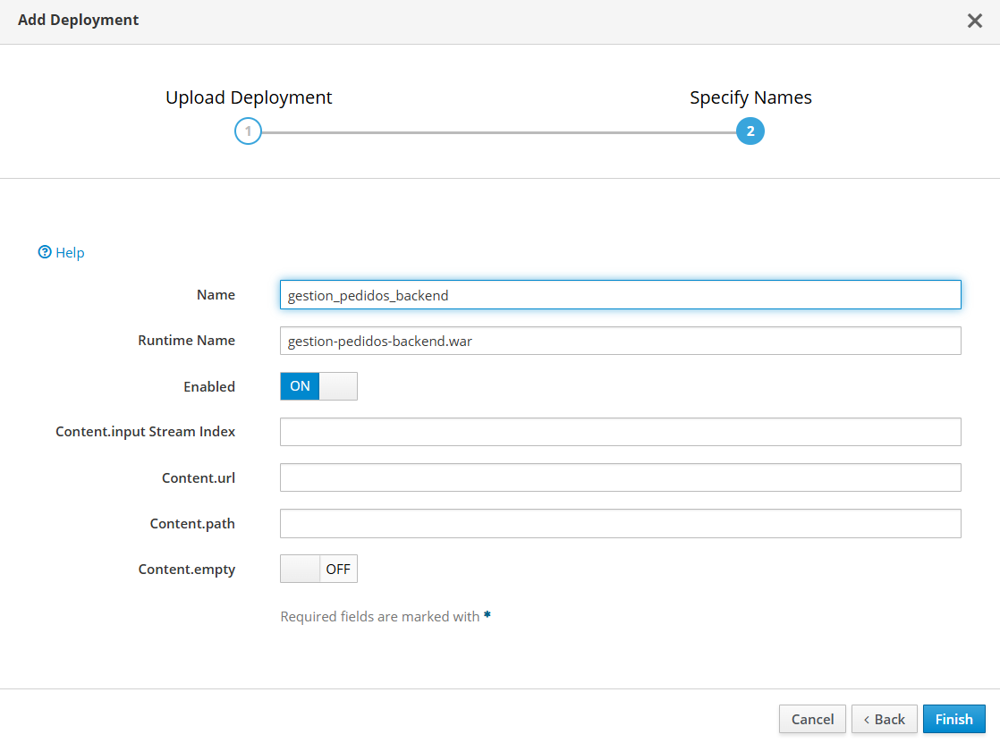

Perfecto, vas avanzando bien. Vamos al punto 4: **desplegar tu aplicación en WildFly**. Asumiré que estás usando Maven y que generaste un archivo `.war` (por ejemplo, `gestionpedidos.war`). Aquí te dejo los pasos detallados:

---

### ✅ **Cómo desplegar tu aplicación en WildFly manualmente**

#### Opción A: Desde la consola web de administración

1. Abre tu navegador y entra a:
   ```
   http://localhost:9990
   ```
   (Es la consola web de administración de WildFly).

2. En el menú de la izquierda, ve a:
   ```
   Deployments → Add
   ```


3. Sube tu archivo `.war` (por ejemplo, `gestionpedidos.war`) que está en:
   ```
   target/gestionpedidos.war
   ```



4. Haz clic en **Next**, luego en **Finish**. Esto debería desplegar tu aplicación.

5. Finalmente, accede a la aplicación desde:
   ```
   http://localhost:8080/gestionpedidos/
   ```

---

#### Opción B: Copiando manualmente a la carpeta `deployments/`

1. Ubica el archivo `.war` generado por Maven, probablemente en:
   ```
   tu-proyecto/target/gestionpedidos.war
   ```

2. Copia ese archivo a la carpeta:
   ```
   <wildfly-home>/standalone/deployments/
   ```

   Ejemplo:
   ```bash
   cp target/gestionpedidos.war /opt/wildfly/standalone/deployments/
   ```

3. WildFly lo desplegará automáticamente. Si todo va bien, verás un archivo `gestionpedidos.war.deployed` en la misma carpeta.

4. Accede desde el navegador:
   ```
   http://localhost:8080/gestionpedidos/
   ```

---

### 🧪 Verifica el log

Puedes abrir otra terminal y ejecutar:

```bash
tail -f <wildfly-home>/standalone/log/server.log
```

Así ves si el despliegue tuvo éxito o si hay errores.

---

¡Perfecto! Ya estás en el paso final del despliegue. En la imagen todo está correcto. Aquí te explico lo que estás viendo y lo que puedes hacer:

---

### ✅ Revisión antes de dar clic en "Finish":

- **Name:** `gestion_pedidos_backend`  
  → Nombre interno en WildFly, puedes dejarlo así.

- **Runtime Name:** `gestion-pedidos-backend.war`  
  → Es el nombre real del archivo `.war`. Este es el que definiste al compilar con Maven. Si es correcto, déjalo tal cual.

- **Enabled:** `ON`  
  → Esto indica que la app se desplegará inmediatamente. ¡Perfecto!

---

### 🚀 Siguiente paso:
Haz clic en **Finish** y espera unos segundos. Si el despliegue fue exitoso:

1. Aparecerá en la lista de *Deployments*.
2. Puedes acceder a tu backend desde la URL:
   ```
   http://localhost:8080/gestion-pedidos-backend/
   ```

---

### 📌 ¿Y si no funciona?

- Si ves error 404 o no carga: puede que el contexto raíz no esté bien configurado en tu app.
- Si lanza error de conexión a base de datos: revisamos el `persistence.xml` y el datasource que ya configuraste.
