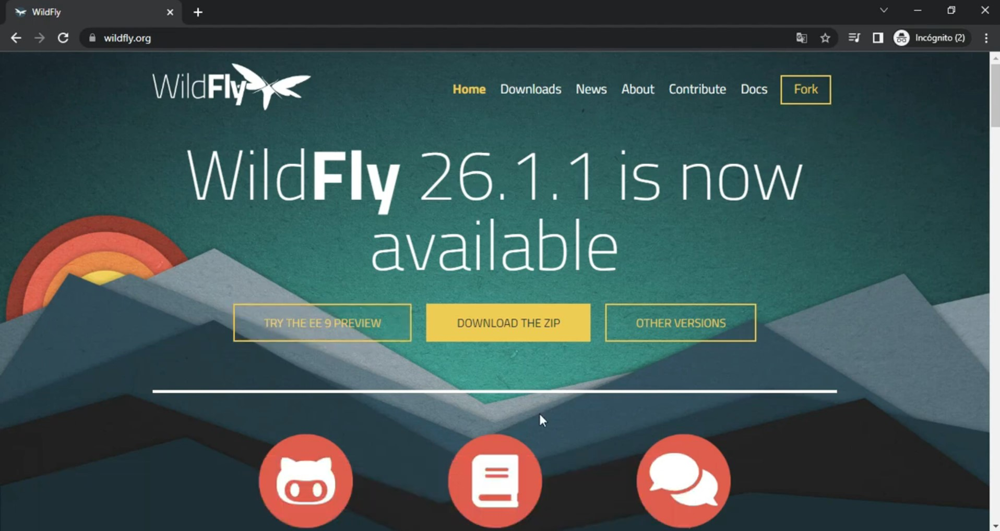
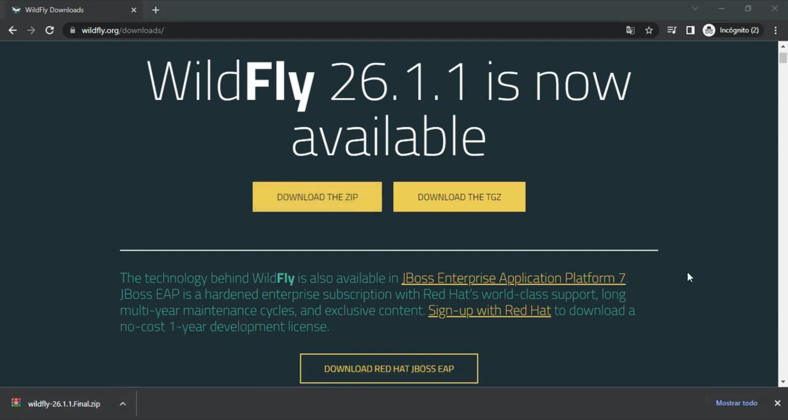
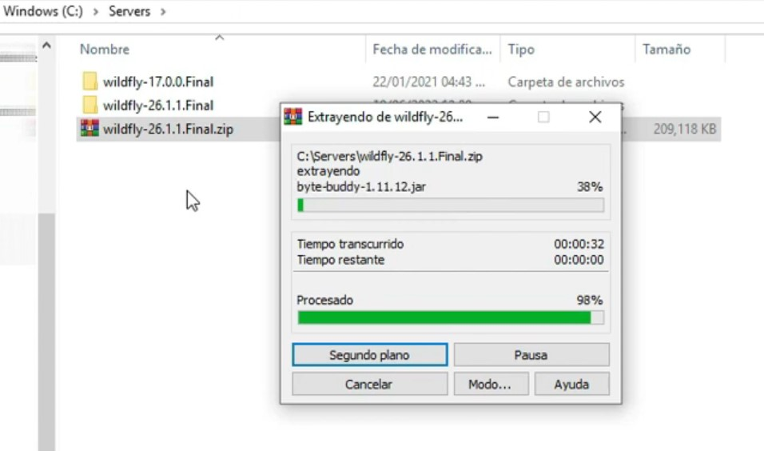
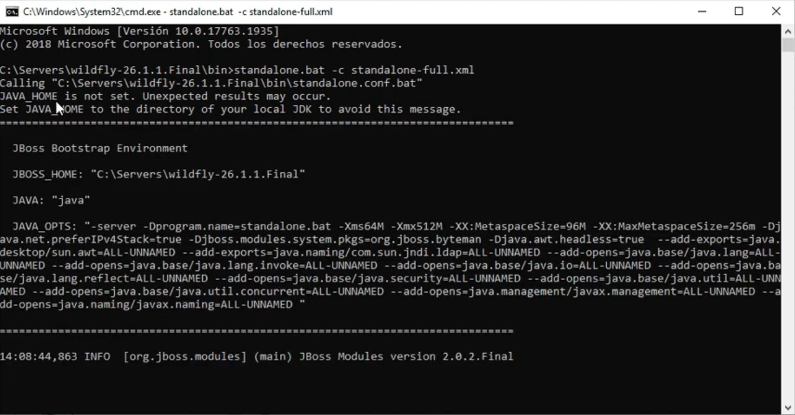
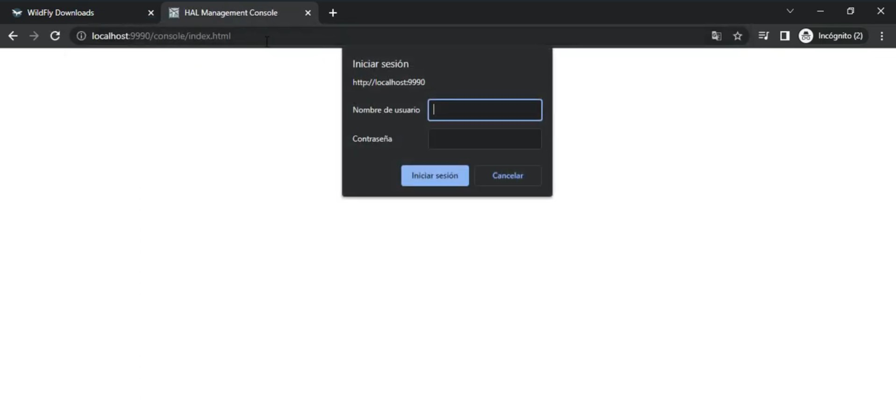
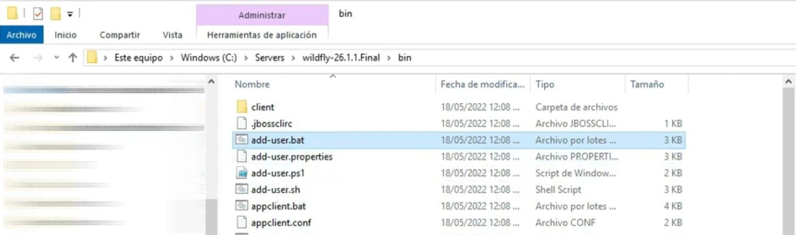
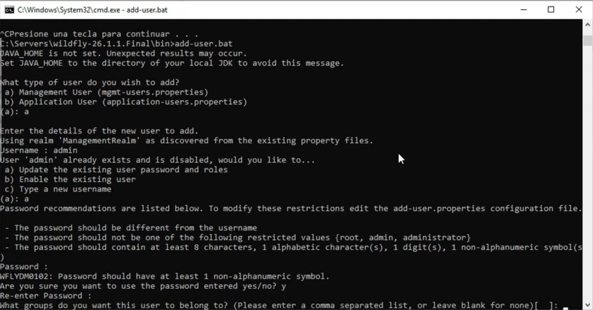
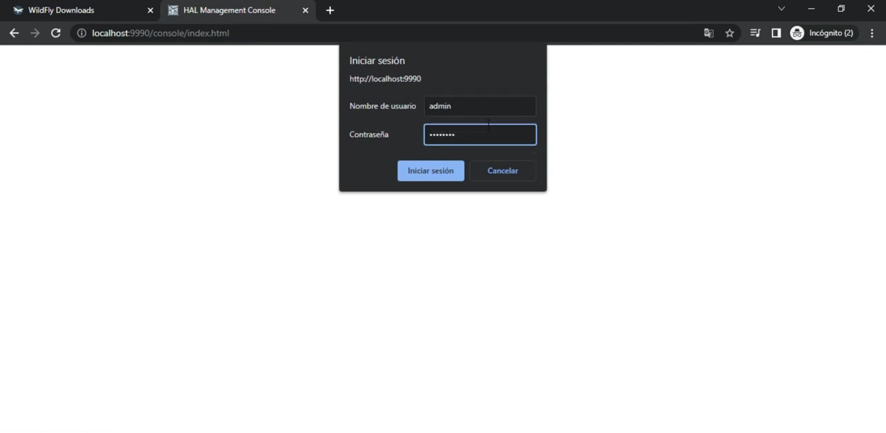
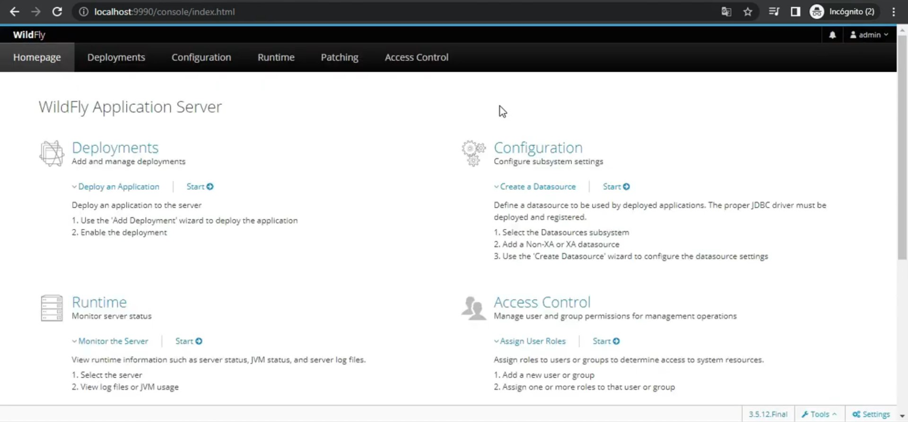
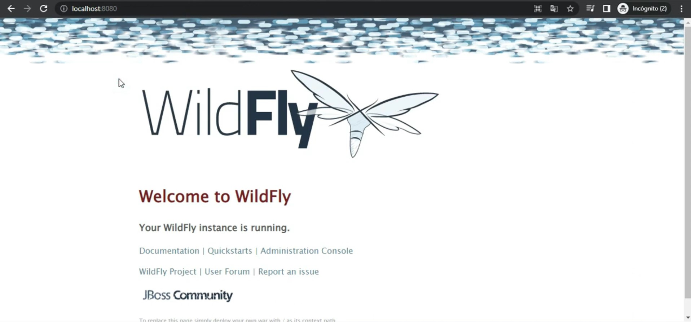

## Cómo instalar y configurar el servidor de aplicaciones WildFly en Windows

En este tutorial aprenderemos a instalar y configurar ***WildFly***, un servidor de aplicaciones de código abierto compatible con ***Java EE*** y ***Jakarta EE***. Este servidor incluye múltiples funcionalidades como pool de conexiones, gestión de sesiones, correo y despliegue de aplicaciones, lo que facilita la administración de proyectos en ***Java***.

Existen varios servidores de aplicaciones como ***WebSphere***, ***WebLogic***, ***GlassFish*** y ***JBoss***, pero en este caso usaremos ***WildFly***, el cual es la base del popular ***JBoss EAP*** de ***RedHat***.

### Pre-requisitos
Antes de comenzar, asegúrate de tener un JDK instalado.

## Paso 1: Descargar WildFly
Abrimos nuestro navegador y buscamos WildFly en Google para ir al sitio oficial. En la sección Download, encontraremos la versión más reciente disponible. Al momento de grabar este tutorial, la última versión estable es la 26.1, compatible con JDK 8 o superior.

Si necesitas una versión específica, en la sección Other Versions encontrarás versiones anteriores. Se recomienda descargar las versiones marcadas como FINAL para mayor estabilidad.

Procedemos a descargar la versión 26.

### Paso 2: Extraer y organizar los archivos
Una vez descargado el archivo, lo movemos a nuestra carpeta de trabajo. En mi caso, utilizo C:\servers para almacenar diferentes servidores de aplicaciones.

- Movemos el archivo .zip a la carpeta C:\servers.
- Extraemos los archivos en esta ubicación.
- Eliminamos el archivo .zip para liberar espacio.

Si tienes versiones anteriores de WildFly, como la 17, puedes mantenerlas organizadas en la misma carpeta para comparar configuraciones.

### Paso 3: Iniciar el servidor
Para iniciar el servidor, navegamos a la carpeta BIN dentro del directorio de WildFly y abrimos un CMD en esta ubicación.

Ejecutamos el siguiente comando para iniciar el servidor con el archivo de configuración completo:

>standalone.bat -c standalone-full.xml

El servidor comenzará a desplegar logs en la terminal. Esperamos a que la inicialización finalice.

### Paso 4: Acceder a la consola de administración
Cuando el servidor termine de iniciarse, la consola de administración estará disponible en la dirección:

`http://localhost:9990`

Abrimos un navegador e ingresamos a la URL. Nos pedirá un usuario y una contraseña, por lo que necesitamos crear un usuario de gestión antes de poder acceder.

### Paso 5: Crear un usuario de administración
Para crear un usuario, primero detenemos el servidor en la terminal presionando CTRL + C dos veces.

Luego, navegamos nuevamente a la carpeta BIN y ejecutamos el siguiente comando:

>add-user.bat

Seleccionamos la opción a para agregar un usuario de gestión. Luego:

- Escribimos el nombre de usuario: admin.
- Si el usuario ya existe, seleccionamos la opción a para actualizarlo.
- Ingresamos una contraseña segura (se recomienda incluir caracteres alfanuméricos).
- Confirmamos la contraseña escribiéndola nuevamente.
Dejamos en blanco la sección de grupos y presionamos Enter.
- Seleccionamos no cuando se nos pregunte si el usuario se conectará a otros procesos.

Listo, el usuario ha sido creado exitosamente.

### Paso 6: Verificar el acceso a la consola

Volvemos a iniciar el servidor y accedemos nuevamente a la consola de administración en `http://localhost:9990`.

Ingresamos el usuario y contraseña creados previamente y presionamos Iniciar sesión. Si todo está bien, ya tendremos acceso a la interfaz de administración de WildFly.

Desde la consola de administración podemos realizar configuraciones, administrar sesiones y monitorear el rendimiento del servidor.

### Paso 7: Comprobar despliegue de aplicaciones
Cuando realicemos un despliegue de una aplicación en este servidor, la dirección por defecto donde se visualizará será:

`http://localhost:8080`

### Conclusión
¡Y eso es todo! Ahora tienes WildFly instalado y configurado correctamente. Puedes utilizar este servidor para desplegar aplicaciones Java EE o Jakarta EE de manera eficiente.