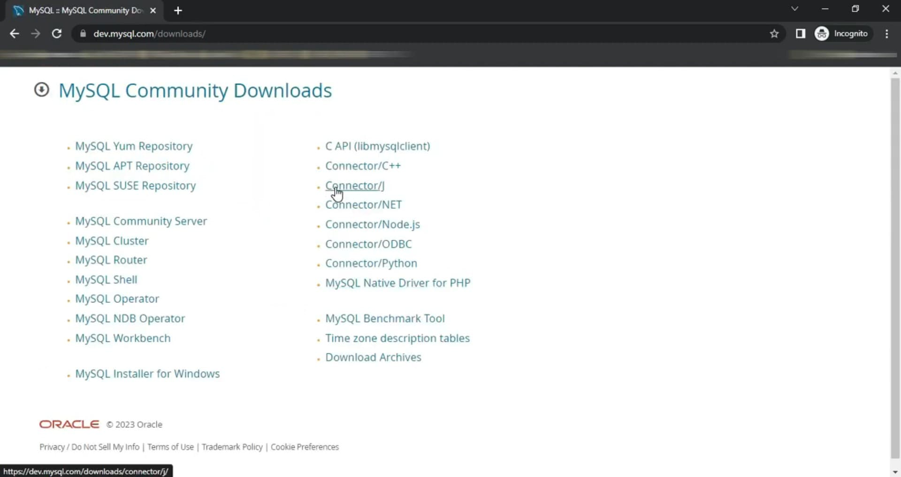
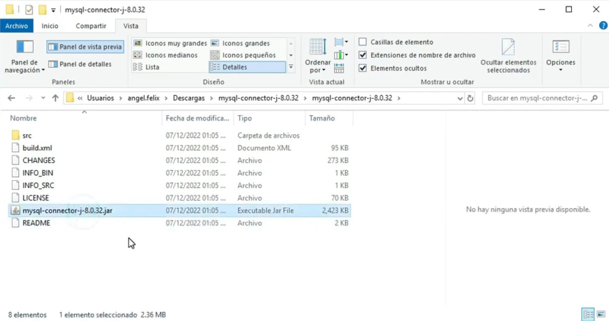

## Cómo instalar y configurar el driver de MySQL en WildFly en nuestro servidor de aplicaciones WildFly, permitiendo que se conecte a bases de datos MySQL sin problemas.

## Pre-requisitos
Antes de comenzar, asegúrate de tener instalado WildFly.

### Paso 1: Descargar el driver de MySQL
Lo primero que necesitamos es obtener el driver JDBC de MySQL. Para ello, seguimos estos pasos:

- Vamos al sitio oficial de ***MySQL***. [https://dev.mysql.com/downloads/]
- En la sección ***Download***, buscamos ***MySQL Community GPL Downloads*** y hacemos clic.
- Seleccionamos ***Connector/J*** y en el menú desplegable elegimos ***Platform Independent***.
- Descargamos el archivo .zip y presionamos Download Now.
- Si no queremos crear una cuenta, podemos hacer clic en ***No Thanks, Just Start My Download.***





### Paso 2: Extraer y organizar los archivos
Una vez descargado el archivo, seguimos estos pasos:

- Vamos a la carpeta de descargas y extraemos el contenido del archivo .zip.
- Navegamos dentro de la carpeta extraída y ubicamos el archivo ***MySQL Connector***, que tiene extensión ***.jar***.



### Paso 3: Agregar el driver a WildFly
Ahora debemos agregar el driver al servidor ***WildFly***. Para ello:

- Abrimos la carpeta donde tenemos instalado ***WildFly***.
- Navegamos a la ruta ***modules/system/layers/base/com***.
- En esta ubicación, creamos una nueva carpeta llamada ***mysql***.
- Dentro de ***mysql***, creamos otra carpeta llamada ***main***.
- Copiamos y pegamos el archivo ***.jar*** del conector en la carpeta ***main***.

Ahora creamos un archivo XML dentro de main y lo llamamos module.xml. Este archivo configurará el driver en el servidor.


### Paso 4: Configurar module.xml
Abrimos module.xml con un editor de texto, como Notepad++, y agregamos el siguiente contenido:

```xml
<module xmlns="urn:jboss:module:1.5" name="com.mysql">
    <resources>
        <resource-root path="mysql-connector-j-8.0.32.jar"/>
    </resources>
    <dependencies>
        <module name="javax.api"/>
        <module name="javax.transaction.api"/>
    </dependencies>
</module>
```

Nos aseguramos de que el nombre del archivo .jar dentro del XML coincida con el que descargamos.


### Paso 5: Configurar el driver en WildFly
Existen dos maneras de hacer esto: a través de la consola web o editando el archivo ***standalone-full.xml***. Primero, lo haremos desde la consola web.

Iniciamos el servidor navegando a la carpeta bin y ejecutamos:
>standalone.bat -c standalone-full.xml

Esperamos a que el servidor inicie y accedemos a la consola de administración en:

`http://localhost:9990`


Iniciamos sesión con el usuario administrador.


### Paso 6: Agregar el driver en la consola de administración
- Vamos a la pestaña Configuration.
- Seleccionamos ***Subsystem*** y luego ***Datasources*** & ***JDBC Drivers***.
- En ***JDBC Drivers***, presionamos Add.
- En ***Driver Name***, escribimos ***MySQL***.
- Para ***Driver Module Name***, copiamos el valor del archivo module.xml ***(com.mysql)***.
- Dejamos ***Module Slot*** vacío y configuramos ***Driver Class Name*** y ***Driver XA Datasource Class Name*** siguiendo la documentación oficial.

Presionamos Add para completar la configuración.


### Paso 7: Configuración manual en standalone-full.xml
Si preferimos configurar el driver editando directamente standalone-full.xml, seguimos estos pasos:

- Detenemos el servidor presionando CTRL + C.
- Abrimos ***standalone-full.xml*** en un editor de texto.
- Buscamos la sección drivers y agregamos las líneas correspondientes al driver de ***MySQL***.

Guardamos los cambios y reiniciamos el servidor.


### Conclusión
¡Y eso es todo! Ahora tenemos el driver de ***MySQL*** instalado y configurado en ***WildFly***, listo para conectar aplicaciones a bases de datos.

