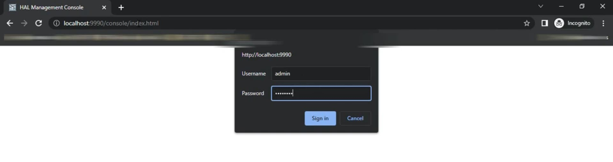
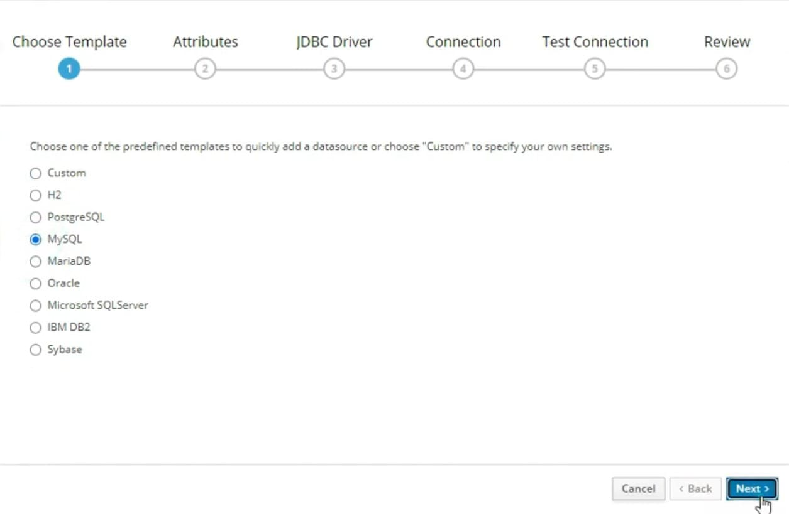
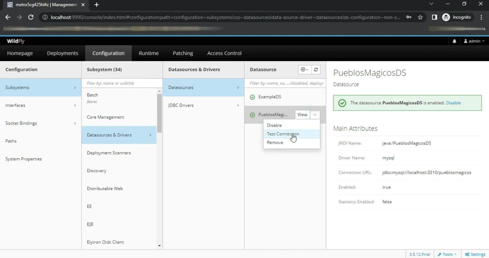

## Cómo crear y configurar un DataSource de MySQL en WildFly

En este artículo aprenderemos a crear y configurar un DataSource de MySQL en nuestro servidor de aplicaciones WildFly, permitiendo que un programa en Java pueda acceder a una base de datos de manera eficiente.

Los DataSource nos facilitan la administración de conexiones y nos ayudan a gestionar los accesos a la base de datos de manera óptima.

### Pre-requisitos
Antes de comenzar, asegúrate de tener instalado el driver de MySQL.

### Paso 1: Verificar la conexión entre el servidor y la base de datos

Antes de configurar el DataSource, debemos asegurarnos de que nuestro servidor de aplicaciones pueda comunicarse con la base de datos. Para ello, abrimos un símbolo del sistema y ejecutamos:

***telnet localhost 3310 (3306 my caso)***

Si no hay respuesta, significa que la base de datos está detenida. En mi caso, la base de datos se ejecuta en un contenedor de Docker, así que simplemente la inicio y espero unos segundos.

Volvemos a ejecutar el comando telnet, y si la respuesta es exitosa, significa que la conexión está establecida.

### Paso 2: Iniciar el servidor de aplicaciones
Ahora debemos iniciar nuestro servidor WildFly. Para ello:

- Navegamos a la carpeta donde tenemos instalado WildFly.
- Entramos en la carpeta bin.
- Abrimos un símbolo del sistema en esta ubicación.
- Ejecutamos el siguiente comando:

>standalone.bat -c standalone-full.xml

Esperamos unos segundos hasta que el servidor inicie.

### Paso 3: Configurar el DataSource en la consola de administración
Accedemos a la consola de administración de WildFly desde nuestro navegador en la siguiente dirección:

`http://localhost:9990`

Iniciamos sesión con nuestro usuario administrador.

### Paso 4: Crear un nuevo DataSource
Dentro de la consola de administración seguimos estos pasos:

- Vamos a la sección Configuration.
- Seleccionamos Subsystem y luego Data Sources and Drivers.
- Presionamos Add y comenzamos la configuración.

En el primer paso, seleccionamos el template para MySQL y presionamos Next.

### Paso 5: Configurar la conexión a la base de datos
Asignamos un nombre a la conexión, en este caso: PueblosMagicosDS. También establecemos el nombre en el campo JNDI java:/PueblosMagicosDS.

Presionamos Next para continuar.

El sistema cargará automáticamente los valores del driver de MySQL que configuramos previamente. Si no aparece, es posible que el driver no esté instalado correctamente.

Presionamos Next para continuar.

### Paso 6: Configurar los parámetros de conexión
Modificamos los siguientes valores:

Connection URL: Cambiamos el puerto si es diferente (por ejemplo, 3310) y el nombre del esquema a pueblosmagicos.
Username: Escribimos el usuario de la base de datos.
Password: Introducimos la contraseña del usuario.
Presionamos Next para continuar.

### Paso 7: Probar la conexión
Presionamos el botón Test Connection para verificar que la configuración es correcta. Si todo está bien, debería aparecer un mensaje de éxito.

Si el servidor se congela en este paso, podemos abrir la terminal y presionar CTRL + C una vez para que continúe.

Presionamos Next y luego Finish para completar la configuración.

### Paso 8: Verificar la configuración
Para asegurarnos de que la conexión quedó configurada correctamente:

Seleccionamos el DataSource recién creado.
En el menú desplegable de View, elegimos Test Connection.
Debería aparecer el mensaje de conexión exitosa en color verde.

### Paso 9: Configuración manual en standalone-full.xml
Si preferimos configurar el DataSource directamente en el archivo de configuración, seguimos estos pasos:

Detenemos el servidor presionando CTRL + C y luego seleccionando S para confirmar.
Abrimos el archivo standalone-full.xml en un editor de texto.
Buscamos la sección Data Sources y agregamos la configuración correspondiente.
Guardamos los cambios y reiniciamos el servidor.

### Conclusión
¡Y eso es todo! Ahora tenemos configurado nuestro DataSource en WildFly y está listo para ser utilizado en una aplicación Java.