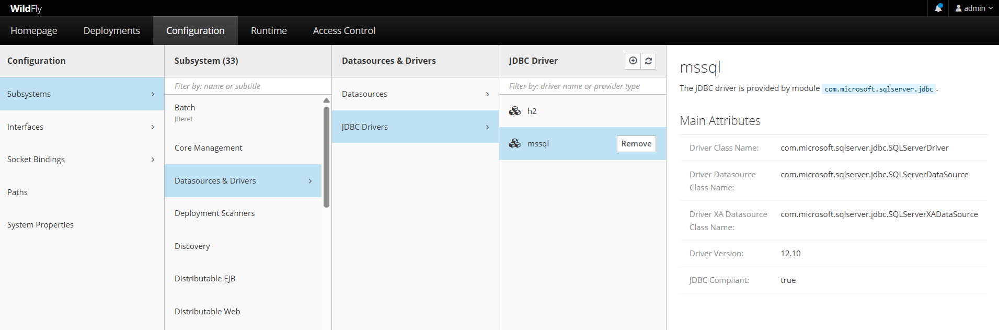

## Index

1. [mssql-driver](#id1)
2. [mysql-driver](#id2)

<div id="id1">

## mssql-driver



***module.xml***
```xml
<?xml version="1.0" encoding="UTF-8"?>
<module xmlns="urn:jboss:module:1.5" name="com.microsoft.sqlserver.jdbc">
    <resources>
        <resource-root path="mssql-jdbc-12.10.0.jre11.jar"/>
    </resources>
    <dependencies>
        <module name="javax.api"/>
        <!-- <module name="jakarta.api"/> -->
        <module name="javax.transaction.api"/>
    </dependencies>
</module>
```

***standalone.xml*** o ***standalone-full.xml***
```xml
<drivers>
  <driver name="h2" module="com.h2database.h2">
      <xa-datasource-class>org.h2.jdbcx.JdbcDatxa-datasource-class>
  </driver>
  <driver name="mssql" module="com.microsoft.sjdbc">
      <driver-class>com.microsoft.sqlserSQLServerDriver</driver-class>
      <xa-datasource-class>com.microsoft.sqlserSQLServerXADataSource</xa-datasource-class>
      <datasource-class>com.microsoft.sqlserSQLServerDataSource</datasource-class>
  </driver>
</drivers>
```

<div id="id1">

## mysql-driver

***module.xml***
```xml
<module xmlns="urn:jboss:module:1.5" name="com.mysql">
    <resources>
        <resource-root path="mysql-connector-j-8.0.32.jar"/>
    </resources>
    <dependencies>
        <module name="javax.api"/>
        <module name="javax.transaction.api"/>
    </dependencies>
</module>
```

wildfly
-------
user: admin
password: qwerty


instancia=MSSQLSERVER

server_name=DESKTOP-BFAMBKT
user=sa
password=qwerty
Trusted_Connection=true
TrustServerCertificate=true
MultipleActiveResultSets=true