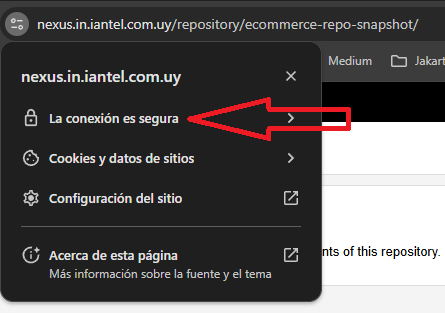
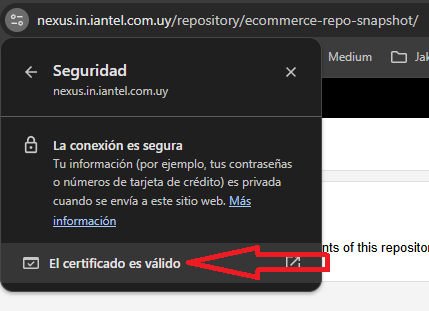
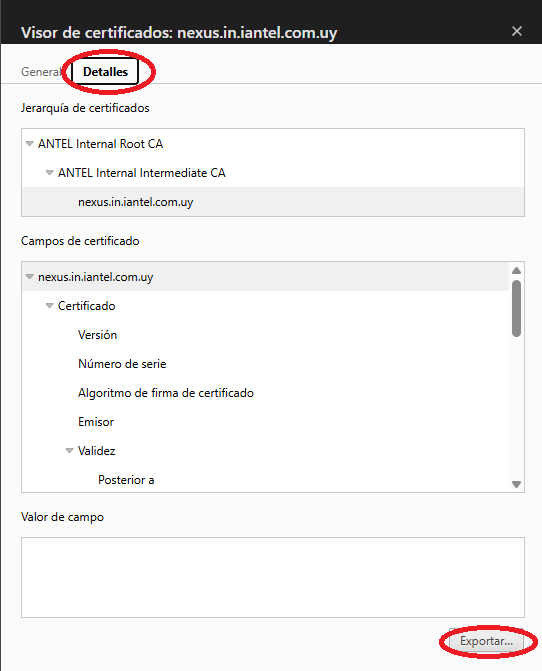

Copiar el certificado en la carpeta ``java/bin`` del java que se esta utilizando

Para descargar los certificados

Luego pararse en la carpeta de `java/bin`

>keytool -import -keystore "..\lib\security\cacerts" -alias [certificado] -file wsi-cima-test.in.iantel.com.uy.crt -storepass changeit

``-alias certificado.crt``

- pi-intg.in.iantel.com.uy.crt
- pi-desa.in.iantel.com.uy.crt
- nexus.in.iantel.com.uy.crt
- picorp.in.iantel.com.uy.crt