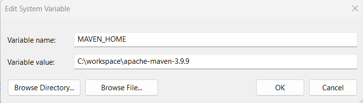

# Spring Boot

**Índice**

1. [Maven](#id1)
   - [1.1 Instalacion](#id1.1)
   - [1.2 Comandos](#id1.2)
2. [Gradle](#id2)

<div id='id1' />

## 1. Maven

<div id='id1.1' />

### 1.1 Instalacion

- Descargar de [Downloading Apache Maven](https://maven.apache.org/download.cgi) el archivo **_apache-maven-3.9.9-bin.zip_** (version para este ejemplo).
- Descomprimirlo donde en cualquier directorio. (mi caso) (**_C:\workspace\apache-maven-3.9.9_**)
- Copiar la direccion donde se encuentra y abrir las variables de entorno.

  - Crear una variable **_MAVEN_HOME_** y asignarle al valor la direccion donde se encuentra **_C:\workspace\apache-maven-3.9.9_**.
  - En la variable **path** crear una nueva y escribir lo siguiente **_%MAVEN_HOME%\bin_**

  

<div id='id1.2' />

### 1.2 Comandos

```bash
mvn clean package
```

Genera el archivo **_.jar_** de un proyecto. Si todo compila bien terminaria con un **BUILD SUCCESS**

```bash
mvn clean package -DskipTests
```

Genera el archivo **_.jar_** de un proyecto. Este comando se salta las pruebas de conexion.
