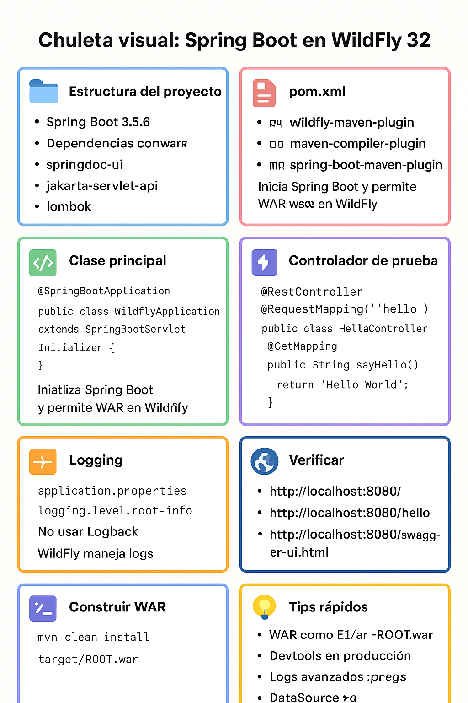

**WildFly 32 con Spring Boot 3.5.6**.
**Documentación clara y paso a paso**

---

# 📄 Guía de despliegue de aplicaciones Spring Boot en WildFly

## 1. Estructura del proyecto

* Proyecto **Spring Boot 3.5.6**
* Empaquetado como **WAR**
* Deploy en **WildFly 32**
* Logging unificado con **JBoss LogManager**
* Documentación de API con **Swagger UI (springdoc)**

---

## 2. Configuración del `pom.xml`

### Dependencias principales

```xml
<dependencies>
    <!-- Web sin Tomcat, para usar el contenedor de WildFly -->
    <dependency>
        <groupId>org.springframework.boot</groupId>
        <artifactId>spring-boot-starter-web</artifactId>
        <exclusions>
            <exclusion>
                <groupId>ch.qos.logback</groupId>
                <artifactId>logback-classic</artifactId>
            </exclusion>
            <exclusion>
                <groupId>org.springframework.boot</groupId>
                <artifactId>spring-boot-starter-tomcat</artifactId>
            </exclusion>
        </exclusions>
    </dependency>

    <!-- API Servlet -->
    <dependency>
        <groupId>jakarta.servlet</groupId>
        <artifactId>jakarta.servlet-api</artifactId>
        <version>6.1.0</version>
    </dependency>

    <!-- Swagger UI -->
    <dependency>
        <groupId>org.springdoc</groupId>
        <artifactId>springdoc-openapi-starter-webmvc-ui</artifactId>
        <version>2.6.0</version>
    </dependency>

    <!-- Hot reload (opcional, solo en desarrollo) -->
    <dependency>
        <groupId>org.springframework.boot</groupId>
        <artifactId>spring-boot-devtools</artifactId>
        <scope>runtime</scope>
        <optional>true</optional>
    </dependency>

    <!-- Lombok -->
    <dependency>
        <groupId>org.projectlombok</groupId>
        <artifactId>lombok</artifactId>
        <optional>true</optional>
    </dependency>

    <!-- Testing -->
    <dependency>
        <groupId>org.springframework.boot</groupId>
        <artifactId>spring-boot-starter-test</artifactId>
        <scope>test</scope>
    </dependency>
</dependencies>
```

### Plugins de build

```xml
<build>
    <plugins>
        <!-- Plugin para despliegue en WildFly -->
        <plugin>
            <groupId>org.wildfly.plugins</groupId>
            <artifactId>wildfly-maven-plugin</artifactId>
            <version>5.1.2.Final</version>
        </plugin>

        <!-- Compilador -->
        <plugin>
            <groupId>org.apache.maven.plugins</groupId>
            <artifactId>maven-compiler-plugin</artifactId>
            <configuration>
                <annotationProcessorPaths>
                    <path>
                        <groupId>org.projectlombok</groupId>
                        <artifactId>lombok</artifactId>
                    </path>
                </annotationProcessorPaths>
            </configuration>
        </plugin>

        <!-- Empaquetado Spring Boot -->
        <plugin>
            <groupId>org.springframework.boot</groupId>
            <artifactId>spring-boot-maven-plugin</artifactId>
            <configuration>
                <excludes>
                    <exclude>
                        <groupId>org.projectlombok</groupId>
                        <artifactId>lombok</artifactId>
                    </exclude>
                </excludes>
            </configuration>
        </plugin>
    </plugins>

    <!-- Nombre del war → ROOT.war (para desplegar en raíz `/`) -->
    <finalName>ROOT</finalName>
</build>
```

---

## 3. Clase principal (`WildflyApplication.java`)

```java
@SpringBootApplication
public class WildflyApplication extends SpringBootServletInitializer {

    public static void main(String[] args) {
        SpringApplication.run(WildflyApplication.class, args);
    }

    @Override
    protected SpringApplicationBuilder configure(SpringApplicationBuilder builder) {
        return builder.sources(WildflyApplication.class);
    }
}
```

---

## 4. Controlador de prueba

```java
@RestController
@RequestMapping("/hello")
public class HelloController {
    @GetMapping
    public String sayHello() {
        return "Hello World desde wildfly";
    }
}
```

---

## 5. Configuración de logging (`application.properties`)

```properties
logging.level.root=info
```

> ⚠️ No uses logback, WildFly ya gestiona el logging con JBoss LogManager.

---

## 6. Construcción del WAR

Desde la raíz del proyecto:

```bash
mvn clean install
```

Esto genera:

```
target/ROOT.war
```

---

## 7. Despliegue en WildFly

### Opción 1: Copiar manualmente

Copiar el WAR a:

```
$WILDFLY_HOME/standalone/deployments/ROOT.war
```

### Opción 2: Usar el plugin Maven

```bash
mvn wildfly:deploy
```

*(Requiere configurar usuario/admin en WildFly con `add-user.sh`)*

---

## 8. Verificación de endpoints

* App principal:
  👉 [http://localhost:8080/](http://localhost:8080/)

* Endpoint de prueba:
  👉 [http://localhost:8080/hello](http://localhost:8080/hello)

* Swagger UI:
  👉 [http://localhost:8080/swagger-ui.html](http://localhost:8080/swagger-ui.html)

---

## 9. Notas importantes

* El WAR se despliega como `ROOT.war` → la app queda en `/` sin sufijos.
* En producción, desactiva **devtools**.
* Para logs más avanzados, configurar `standalone.xml` de WildFly.
* Si usas BD, se recomienda configurar **DataSource en WildFly** en lugar de `application.properties`.

